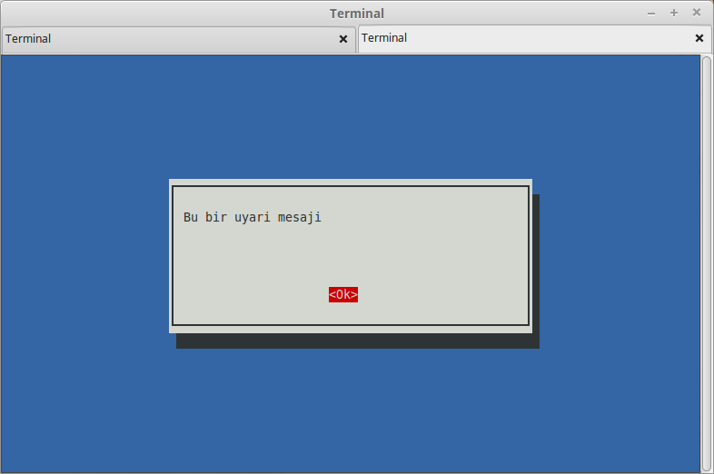
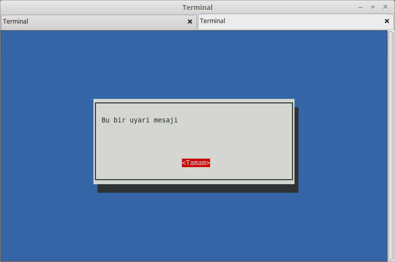
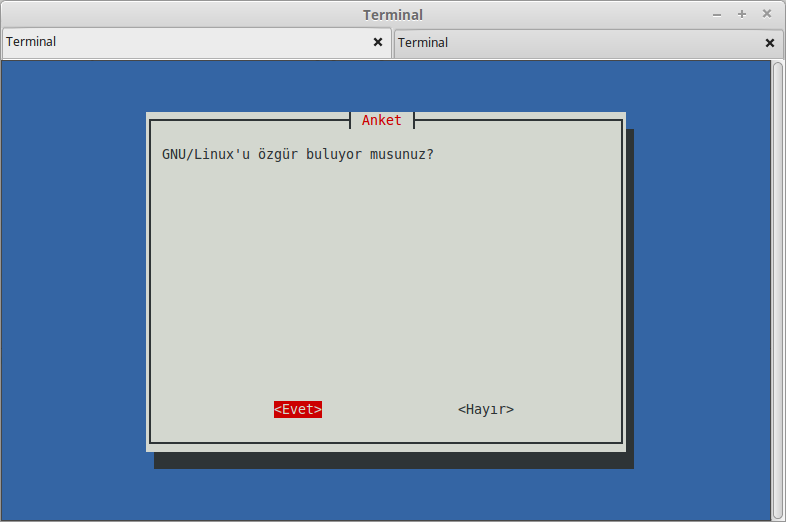
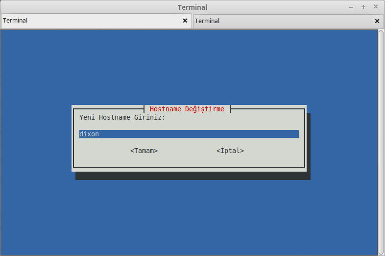
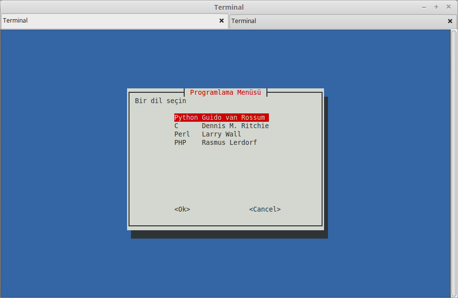

# Menüler

Yazdığınız programların kullanıcı ile etkileşimini sağlayan çeşitli menüler oluşturmak isteyebilirsiniz. Aşağıda iki yöntemini sunacağız.

##select

En temel yöntem select komutunu kullanmaktır. for loop kullanır gibi kullanıcı etkileşimi oluşturmanızı sağlar. Temel yapsını paylaşıyoruz. Bunun üzerine kendi programınızı geliştirip fonksiyonlarla süsleyebilirsiniz.


```bash
eaydin@dixon ~/calisma/bash $ cat select.sh 
#!/bin/bash

SECENEKLER="Disk-Durumu Yardim Cikis"
select i in $SECENEKLER; do
    if [ "$i" = "Cikis" ]; then
        exit
    elif [ "$i" = "Yardim" ]; then
        echo "Yardim menusu"
    elif [ "$i" = "Disk-Durumu" ]; then
        df -h
    else
        echo "Secenek Anlasilmadi?"
    fi
done
eaydin@dixon ~/calisma/bash $ ./select.sh 
1) Disk-Durumu
2) Yardim
3) Cikis
#? 1
Filesystem      Size  Used Avail Use% Mounted on
/dev/sda3       346G   32G  296G  10% /
none            4,0K     0  4,0K   0% /sys/fs/cgroup
udev            3,8G  4,0K  3,8G   1% /dev
tmpfs           777M  1,5M  775M   1% /run
none            5,0M     0  5,0M   0% /run/lock
none            3,8G  114M  3,7G   3% /run/shm
none            100M   20K  100M   1% /run/user
/dev/sda6       374G  150G  225G  40% /media/backups
#? 3
eaydin@dixon ~/calisma/bash $
```

## whiptail

whiptail başlı başına incelenmesi gereken ve kompleks menüler sunmanızı sağlayan bir programdır. Burada temel olarak nasıl mesajlar sunabileceğinizin üzerinden geçeceğiz.

### msgbox

Aşağıdaki gibi bir komut ile görsel bir uyarı sağlayabilirsiniz.

```bash
whiptail --msgbox "Bu bir uyari mesaji" 10 50
```



Komutun sonundaki rakamlar, pencerenin yüksekliğini ve genişliğini belirtir.

Örneğin **Ok** yerine **Tamam** yazmasını sağlayabiirdik.

```bash
whiptail --msgbox "Bu bir uyari mesaji" 10 50 --ok-button="Tamam"
```




### yes/no

Programınızın basit Evet/Hayır soruları sormasını sağlayabilirsiniz.

```bash
#!/bin/bash

whiptail --title "Anket" --yesno "GNU/Linux'u özgür buluyor musunuz?" \
--yes-button Evet --no-button Hayır 20 60
if [ $? -eq 0 ]; then
    whiptail --msgbox "Çok haklısınız!" --ok-button Tamam 10 40
else
    whiptail --msgbox "Yanılıyor olabilirsiniz" --ok-button Tamam 10 40
fi
```


### inputbox

Kullanıcıdan girdi almak için inputbox kullanabilirsiniz.

```bash
#!/bin/bash

YENI_HOSTNAME=$(whiptail --inputbox "Yeni Hostname Giriniz:" \ 
8 60 $(hostname) --title "Hostname Değiştirme" --ok-button Tamam \
--cancel-button İptal 3>&1 1>&2 2>&3)

exitstat=$?

if [ $exitstat = 0 ] && [ ! -z $YENI_HOSTNAME ]; then
    hostname $YENI_HOSTNAME
else
    echo "işlem iptal edildi"
fi
```

Yukarıdaki program, inputbox ile sonuç dinler, eğer "Tamam" seçeneği işaretlenmiş, ve YENI_HOSTNAME değeri boş değilse **hostname** komutunu kullanarak bilgisayar adını değiştirir, aksi taktirde işlemi iptal eder. Programın girdi kutucuğunun öntanımlı değeri olarak mevcut hostname'i kullandığı görülebilir.



### menu

Aşağıdaki yöntemle kullanıcılarınıza bir menü sunabilirsiniz.

```bash
#!/bin/bash

SECIM=$(whiptail --title "Programlama Menüsü" \
--menu "Bir dil seçin" 17 50 0 \
"Python" "Guido van Rossum" \
"C" "Dennis M. Ritchie" \
"Perl" "Larry Wall" \
"PHP" "Rasmus Lerdorf" 3>&1 1>&2 2>&3)

if [ $? = 0 ] && [ ! -z $SECIM ]; then
    echo "$SECIM dilini seçtiniz"
else
    echo "Dil seçmediniz"
fi
```


