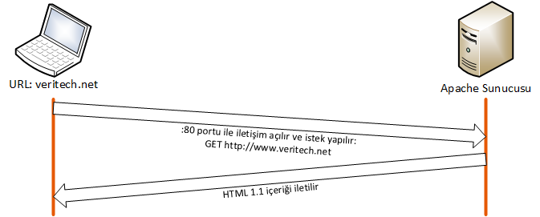

# Bir sayfanın İnternetteki Serüveni

Vermiş olduğumuz eğitimlerde, çoğunlukla İnternet'in çalışma mantığının çok iyi anlatılmadığı ya da kavranmadığı konusunda deneyimlerimiz tecrübe ile sabittir.

Günümüzde kullanılan İnternet Alan Adı çözme sistemi belirli konsorsiyumların ve iktidar odaklarının denetiminde ve tekelindedir. ABD merkezli kar amacı gütmeyen ICANN (Internet Corporation for Assigned Names and Numbers) adlı organizasyon, tüm alan adı çözünürlüğünün dağıtımını sağlamaktadır. Örneğin ".com" uzantılı alan adlarını sadece VeriSign adlı Amerikan firması yapabilir ve ICANN her yıl ücretlerini %7 oranında arttırabilmesi için yetki vermiştir.

İşletim sistemleri ve onların bağlı bulunduğu DNS sunucuları, ICANN'in belirlemiş olduğu kök DNS sunucularını kurulumları sırasında "varsayılan" kök DNS sunucuları olarak belirler. Linux sistemlerde şu komut ile kök sunucularının bilgisine ulaşabilirsiniz.

```bash
dig +nocomments
; <<>> DiG 9.8.2rc1-RedHat-9.8.2-0.37.rc1.el6_7.4 <<>> +nocomments
#;; global options: +cmd
#;.                              IN      NS
#.                       58399   IN      NS      h.root-servers.net.
#.                       58399   IN      NS      i.root-servers.net.
#.                       58399   IN      NS      e.root-servers.net.
#.                       58399   IN      NS      f.root-servers.net.
#.                       58399   IN      NS      c.root-servers.net.
#.                       58399   IN      NS      j.root-servers.net.
#.                       58399   IN      NS      m.root-servers.net.
#.                       58399   IN      NS      a.root-servers.net.
#.                       58399   IN      NS      l.root-servers.net.
#.                       58399   IN      NS      g.root-servers.net.
#.                       58399   IN      NS      b.root-servers.net.
#.                       58399   IN      NS      k.root-servers.net.
#.                       58399   IN      NS      d.root-servers.net.
#a.root-servers.net.     158901  IN      A       198.41.0.4
#a.root-servers.net.     158901  IN      AAAA    2001:503:ba3e::2:30
#b.root-servers.net.     158901  IN      A       192.228.79.201
#b.root-servers.net.     158901  IN      AAAA    2001:500:84::b
#c.root-servers.net.     158901  IN      A       192.33.4.12
#c.root-servers.net.     158901  IN      AAAA    2001:500:2::c
#d.root-servers.net.     158901  IN      A       199.7.91.13
#d.root-servers.net.     158901  IN      AAAA    2001:500:2d::d
#e.root-servers.net.     158901  IN      A       192.203.230.10
#f.root-servers.net.     158901  IN      A       192.5.5.241
#f.root-servers.net.     158901  IN      AAAA    2001:500:2f::f
#g.root-servers.net.     158901  IN      A       192.112.36.4
#h.root-servers.net.     158901  IN      A       198.97.190.53
#;; Query time: 0 msec
#;; SERVER: 127.0.0.1#53(127.0.0.1)
#;; WHEN: Mon Dec  7 23:31:25 2015
#;; MSG SIZE  rcvd: 496
```
Aynı bilgiyi ```/var/named/named.ca``` dosyası içerisinde de bulabilirsiniz. 
Ne var ki, root DNS sunucularını kendi belirlediğiniz kök sunucularla değiştirebilir, kendi alan adı eko sisteminizi de oluşturabilirsiniz, bu durumda bu yazının yazarı ".karaca" uzantılı alan adlarını kullanmaya başlayabilir.

Bir URL'i açmak için masaüstü bilgisayarınızdan tarayıcınıza alan adını yazdığınızda oluşan sorgu adımları aşağıdaki grafikte tanımlanmıştır:


DNS sorgu adımları tamamlandıktan sonra, tarayıcınız (browser) ilgili web sunucunusun daha önceden tanımlanmış standart HTTP portu* ile bu sunucuya erişim kurup HTTP 1.1 protokolü ile istenilen web sitesini rica eder.

Daha sonra DNS sorgusuna göre daha kolay olan bir şekilde TCP soketi web sunucusuna doğru açılır ve istek yapılır, eğer sunucu direktiflerinde sorgu yapılan IP adresinde servis veren bir host ya da virtual host varsa, içerik talep eden tarafa iletilir.



* **IANA:** Internet Assigned Numbers Authority, kar amacı gütmeyen bir kuruluştur, 0 ve 1000 arası portların isimlendirilmesini IETF'ye bırakır, geri kalan tüm portların isimlendirmesi için bireysel başvuruda bulunabilirsiniz, onay sürecinden sonra kendi port numaranıza belirlediğiniz isim tüm dünyada kabul görecektir.IETF Web sayfalarının standart sunum portunu :80 olarak belirlemiştir. Aslında gerçek sorgu şu şekildedir: http://www.veritech.net:80 