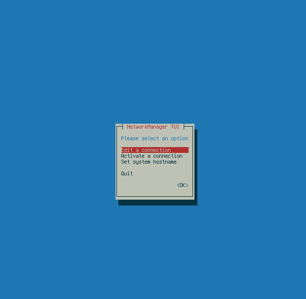
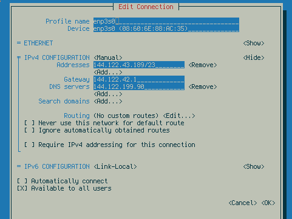

# Network Ayarları

## Metod 1: dhcpcd

Statik IP kullanılmak istenmemesi durumunda Arch Linux internete dhcpcd servisini kullanarak bağlanmaya hazır durumdadır. Ancak detaylı bir IP konfigürasyonu gerektiğinde varsayılan ayarlar yeterli olmayacaktır. Arch Linux dhcpd servisi internete nasıl bağlanacağını görmek için bir konfigürasyon dosyası kullanır. Aktif interface isimlerini görmek için ise `ip addr` komutunu kullanabilirsiniz. 

Herhangi bir ayarı değiştirmeden önce `dhcpd.service` servisini durdurmanız tavisye edilir.

`systemctl stop dhcpd.service`

Bundan sonra konfigürasyon dosyasını editleyebilirsiniz.dhcpcd

`vim /etc/dhcpcd.conf`

Bu dosyadan gerekli IP adresi ayarlamalarını yapabilirsiniz. Statik bir IP konfigürasyonu için aşağıdaki örneği inceleyiniz.

```
interface eth0
static ip_address=10.1.1.30/24
static routers=10.1.1.1
static domain_name_servers=10.1.1.1

interface wlan0
static ip_address=10.1.1.31/24
static routers=10.1.1.1
static domain_name_servers=10.1.1.1
```
Bu şekilde kurulmuş bir ayarı `/etc/dhcpcd.conf` dosyasının en altına yerleştirebilirsiniz.

Ayarlamalarınız bittikten sonra `dhcpcd.service` servisini yeniden başlatıp, aktifleştirmediyseniz aktifleştiriniz.

```
systemctl start dhcpcd.service
systemctl enable dhcpcd.service
```

## Metod 2: NetworkManager TUI

Hem kabalolu hem de kablosuz internet erişimini çok kolaylaştırması adına kullanılabilecek bir paket olan NetworkManager'i kurabilirsiniz.

`pacman -Syu networkmanager`

Kullanmaya başlamak için servisi başlatmanız ve makineyi kapattığınızda ayarların kalması için enable etmeniz gerekiyor.

```
systemctl start networkmanager
systemctl enable networkmanager
```

Ayarlama paneline ulaşmak için:

`nmtui`



Karşınıza son derece sade bir ayar paneli gelecek. Yeni bir bağlantı eklemek ya da mevcut bağlantıları değiştirmek için `Edit a connection` seçeneğini seçebilirsiniz. Eğer daha önceden ayarlanmış olan ağlara başlanmak içi `Activate a connection` seçeneğini ve sisteminizin hostname'ini değiştirmek için `Set system hostname` seçeneklerini seçebilirsiniz.



Burada gerçekleştirdiğiniz ayarların etkin hale gelmesi için bir önceki menüden `Activate a connection` seçenegini seçerek modifiye ettiğiniz bağlantıyı kapatıp açmanız yeterlidir. `NetworkManager` daemonunu yeniden başlatımanıza gerek olmayacaktır.
