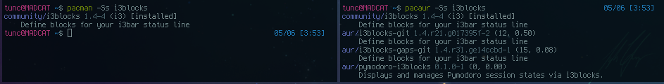

# pacman Paket Yöneticisi

pacman paket yöneticisi Arch Linux'un enbelirgin ve ayırıcı özelliklerinden birisidir. pacman'ın amacı, paketlerin kullanıcının kendi paketleri ya da resmi repositoryden (paket kaynağı) indirilmiş paketler olmasını ayırt etmeksizin kolay ve düzenli bir şekilde yönetilebilmesini sağlamaktır. 

pacman sistemi güncel tutabilmek için lokal paket listesini ana sunucunun paket listesi ile senkronize eder. Tek bir yükleme komutu ile ihtiyaç olan bağımlılıkları (dependency) takip edip, esas istenen paketlerle birlikte sisteme kurar. pacman paketleri _.pkg.tar.xz_ formatını kullanır.

pacman paket yöneticisinin kendi ayarları `/etc/pacman.conf` dosyasında bulunur. Buradan cache directory seçmek, renkleri açmak, repositoryleri açıp kapamak mümkündür. 

pacman kullanarak bir paket yüklemek için sadece tek bir komut yeterlidir. _gvim_ paketini yüklemek isterseniz:

`pacman -S gvim`

komutunu kullanmanız yeterli olacaktır. Aynı şekilde _gvim_'den sonra başka paket isimleri yazarak tek komut ile birden fazla paket yüklemeniz mümkündür. Genel olarak, her paket yüklemesi yaptığınızda aynı zamanda mevcut paketleri de güncellemeniz önerilir. Eğer paket listesini güncellerken sistemi güncellemezseniz, dependency sorunları ile karşılaşabilirsiniz.

| Komut  | Açıklama                                                                                                      |
| -      | -                                                                                                             |
| `-S`   | Paketi, dependencyleri ile birlikte indirip kurar.                                                            |
| `-Sy`  | Veritabanını günceller ve paketi kurar. Dependency </br>sorunları yaratabileceği için  __kullanmamalısınız__. |
| `-Syu` | Veritabanını ve sistemi güncelleyip seçtiğiniz paketi kurar.                                                  |

Dolayısıyla Arch Linux'ta en çok tercih edilen  yükleme komutu `pacman -Syu ` komutudur. Sadece sistemi güncellemek için ise aynı komut, herhangi bir  ismi eklemeden yazılır. 

Herhangi bir i silmenin birden çok yolu vardır.

| Komut  | Açıklama                                                                |
| -      | -                                                                       |
| `-R`   | Paketi, dependency'lerine dokunmadan siler.                             |
| `-Rs`  | Paketi ve başka ler tarafından gerekli olmayan dependency'lerini siler. |
| `-Rsc` | Paketi, dependency'lerini ve bu pakete bağlı olan tüm leri siler.       |

Aşağıdaki listede sık kullanılan pacman seçeneklerini ve açıklamalarını bulabilirsiniz. Bu liste sadece örnek amaçlıdır, pacman'in opsiyonlarını pek çok farklı şekilde kullanmak mümkündür. 

Hepsini paket ismi koyarak ya da koymadan yazabilirsiniz ancak yanında __x__ yazanlar, paket ismi yazmanız tavsiye edilenlerdir.

| Komut        | Açıklama                                |
| -            | -                                       |
| `-Syu`       | Paket ve sistem güncelleme              |
| `-Syu` _x_   | Paket yükleme ve güncelleme             |
| `-Rcnsu` _x_ | Paketi tüm dependency'leri ile silme    |
| `-Q`         | Lokal paket listesi                     |
| `-Ql` _x_    | Paket içeriği                           |
| `-Ss` _x_    | Paket arama                             |
| `-Qen`       | Kullanıcı tarafından yüklenmiş paketler |
| `-Rso`       | _Orphan_ paketleri silme                |

## AUR

AUR (Arch User Repository), resmi repositorylerin dışında, tamamen kullanıcılar tarafından oluşturulmuş muazzam bir repositorydir. AUR içerisinde pre-compile edilmiş binary dosyalar yerine, paketlerin kaynak kodundan kolayca compile edilmesini sağlayan __PKGBUILD__ tanımları vardır. Bu tanımlar kullanılaraki paketler kolayca _mkpkg_ tarafından compile edilir ve _pacman_ tarafından yüklenir (_mkpkg_ pacman'in bir parçasıdır). 

AUR'u kullanarak paket yüklemenin birden fazla yöntemi bulunmakta ancak bunlardan daha kolay olanı bir AUR Helper kullanmak olacaktır. Bunu yapmak için önce bu helper programlardan bir tanesini elle kurmalısınız. Bu kurulumu bir kere tamamladıktan sonra, kurulum için gerçekleştirmiş olduğunuz işlemleri, bundan sonra helper program devralacaktır ve siz resmi repositorylerden normal bir paket yükler gibi AUR'u kullanabilecek hale gelirsiniz.

AUR'da çok fazla helper program bulunmakta ama biz pacman'e benzerliği ve kullanışı sebebiyle örnek olarak __pacaur__'u kuracağız.

Başlamadan önce dependencyleri yüklemelisiniz. 

`sudo pacman -Syu expac yajl git --noconfirm --needed`

pacaur'un resmi repolardaki dependencylerini indirdikten sonra bir tane de AUR içerisinde bulunan dependency'sini indirmelisiniz.

```
mkdir cower && cd cower
curl https://aur.archlinux.org/cgit/aur.git/plain/PKGBUILD?h=cower -o PKGBUILD
makepkg PKGBUILD --skippgpcheck --install --needed
```
Bu basamaktan sonra artik pacaur paketini de aynı şekilde indirip kurabilirsiniz.

```
mkdir pacaur && cd pacaur
curl https://aur.archlinux.org/cgit/aur.git/plain/PKGBUILD?h=pacaur -o PKGBUILD
makepkg PKGBUILD --skippgpcheck --install --needed
```
Yükleme tamamlandıktan sonra, kullanılan geçici dosyaları silebilirsiniz. pacaur'un kullanımı pacman ile tamamen aynıdır. pacman için kullanılan komutların tamamı pacaur için de kullanılabilir ancak bu sefer resmi repoların yanında AUR da komutlarınızın sonuçlarına dahil olmuş olur. Örneğin paket aramak için kullandığınız `pacman -Ss` komutunu, pacaurda `pacaur -Ss` olarak kullanabilirsiniz.


