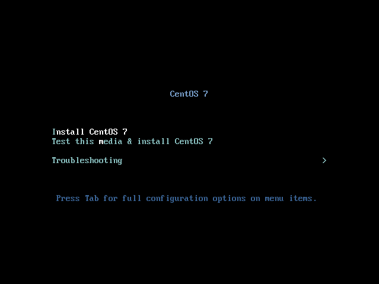
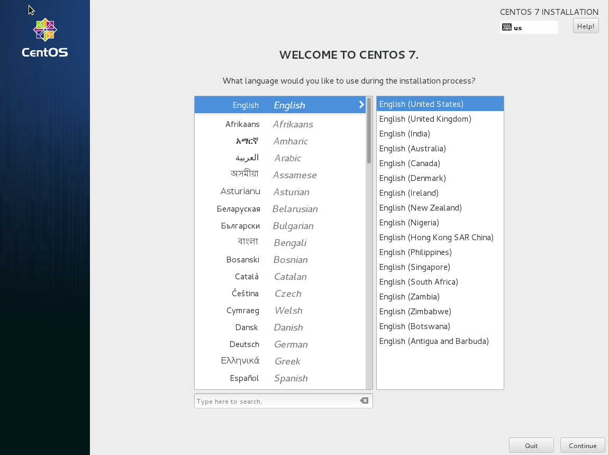

# CentOS

Bağlı bulunduğumuz sunucudan veyahut sistemden cdrom'u boot ederek başlıyoruz. Boot ettikten sonra önümüze gelen ilk ekranda 5 farklı seçenek olacak ve biz "Install CentOS 7" başlığını seçiyoruz.

Önümüze gelen ekranda varolan medyanın veri kaybına uğrayıp uğramadığını test edip etmek istemediğimizi soruyor. Bu bölgeyi skip ederek geçebilirsiniz.

