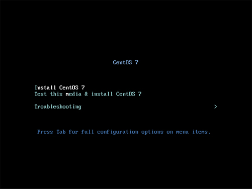
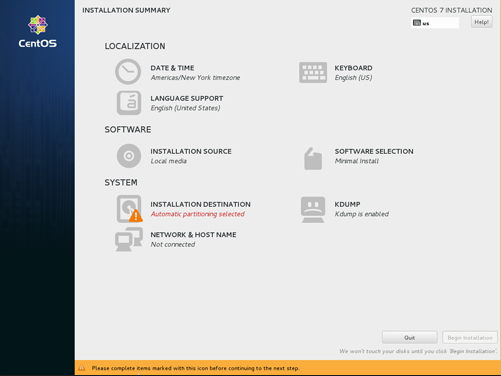
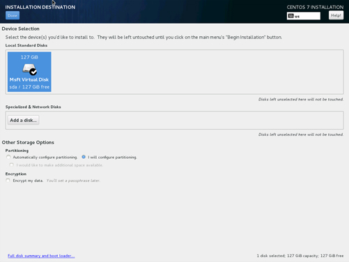
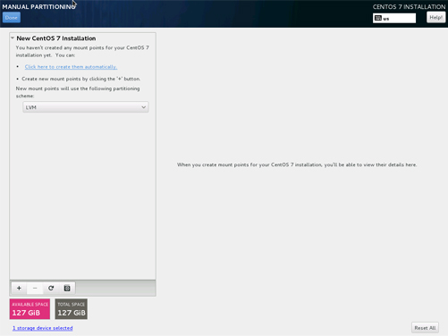
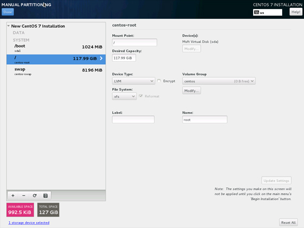
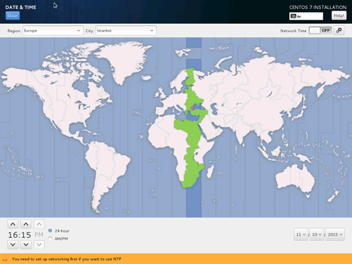
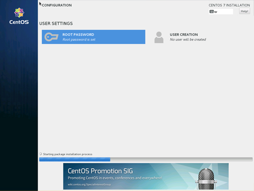
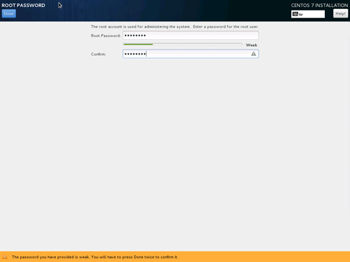

# CentOS Yükleme Rehberi

Bağlı bulunduğumuz sunucudan veyahut sistemden cdrom'u boot ederek başlıyoruz. Boot ettikten sonra önümüze gelen ilk ekranda 5 farklı seçenek olacak ve biz "Install CentOS 7" başlığını seçiyoruz.

Önümüze gelen ekranda yükleme süreci boyunca hangi dili kullanmak istediğinizi sorar. Bu noktada size uygun hangi seçenek ise onu işaretleyiniz.

Burası yükleme ekranının bulunduğu ana menü. Bu noktada diskinizi istediğiniz sekilde diskinizi biçimlendirip, klavye layoutunuzu seçip, timezone ayarlayabilirsiniz.

Disk biçimlendirme işlemi için "Installation Destination"a tıklıyoruz. Önümüze gelen ekranda diski seçip, dilerseniz otomatik, dilerseniz custom layout yaratabilirsiniz. Biz bu örnekte custom layout üzerinden gideceğiz.

Herhangi bir bölüm eklemek için aşağıdaki + ya tıklayıp, önünüzdeki gelen pencerede bölümünüzü ve boyutunuzu ekleyebilirsiniz.

Bu noktada layout değerlerinin boyutu size kalmış ancak diskte bazı varolması gereken bölümler aşağıdaki tabloda belirtilmiştir.

|Mount Point | Boyut |
|--|--|
|/root|1024 MiB|
|swap |8196 MiB|
|/  |Geri Kalan Alan|

Bu noktadan sonra ana menüden timezone (Zaman Dilimi) seçmemiz gerekiyor. Resimde tahmin edeceğiniz üzere İstanbul'u seçtik. 

Root password ve şifresi ana menüde "Begin Installation" aktif olduktan sonra seçeceğiz. Burada genellikle strong password kullanmaya özen gösterin.

Strong Password : Büyük küçük harf noktalama ve rakam ihtiva eder.

En son makinenizi reboot ederek CentOS 7 kurulumunu tamamlamış olursunuz.

