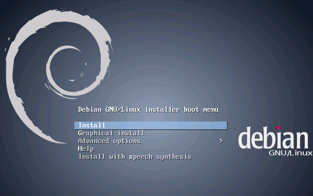
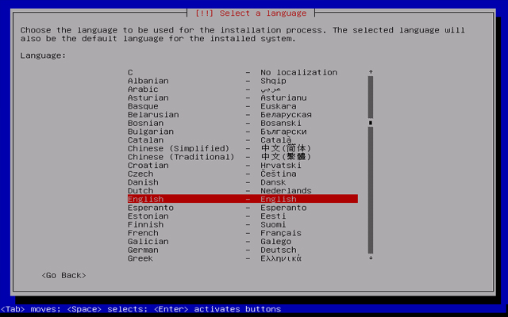
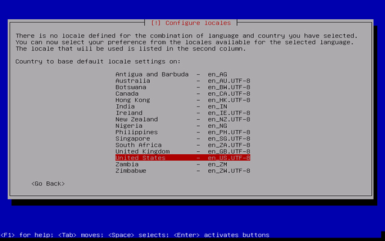
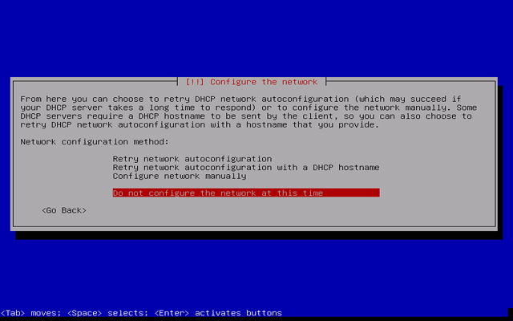
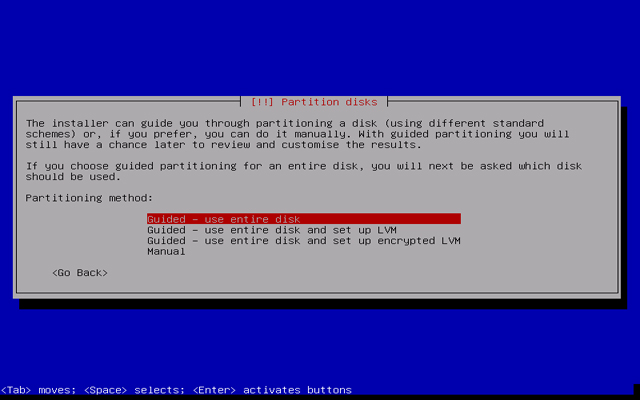
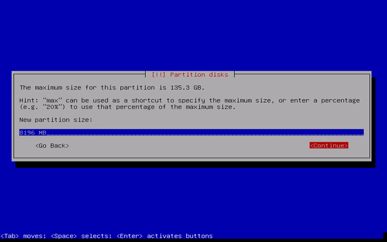
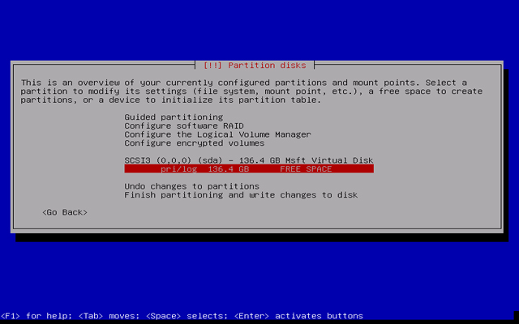
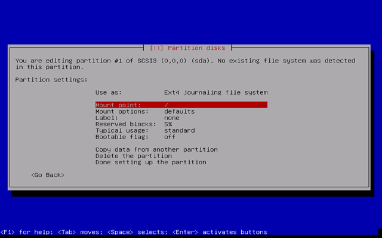
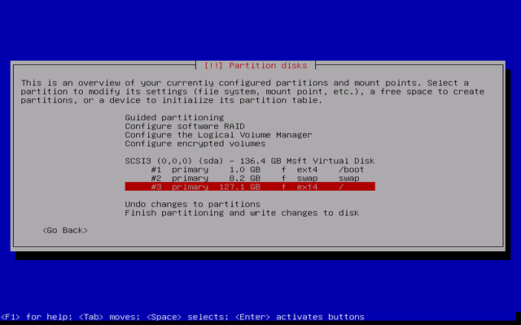
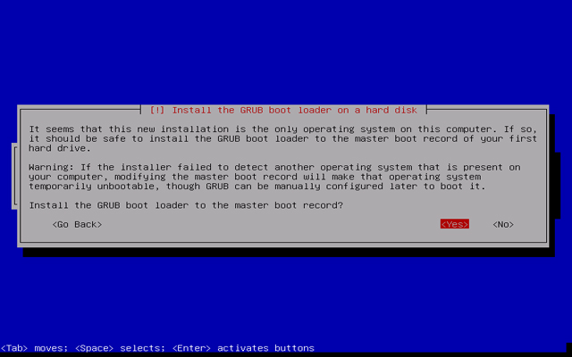

# Debian Yükleme Rehberi

Debian kurulum cdsini boot ettikten sonra karşımıza gelen ekranda "Install Debian" seçeneğini tıklıyoruz.

Yükleme esnasındaki dil paketini seçiyoruz.

Konumumuzu bildiriyoruz.

Debianda Türkiye ile uyuşan herhangi bir dil paketi bulunmamakta. Bu yüzden UTF-8 formatındaki United States seçeneğini isaretliyoruz.

Bu ekranda ağ ayarlarını yapabileceğiniz gibi, daha sonradan ayarlamak üzere geçebilirsiniz.

Hostname ayarlamamızı yapıyoruz. Sonraki gelen müteakip adımlarda ise sifremizi giriyoruz. Debian bu asamadan sonra sizden kullanıcı açmanızı isteyecek, bunlar admin,root veya user'dan farklı olmalıdır.

Sonraki aşamada ise diskimizin bölümlerini ayarlıyoruz. Buradaki bölümlemeler

|Mount Point | Boyut |
|--|--|
|/root|1024 MiB|
|swap |8196 MiB|
|/  |Geri Kalan Alan|

İşaretli olan diski tıklayarak ilerliyoruz. Bu noktadan sonra sırasıyla
1. 
Boyut ayarlama
2. 
/root, swap, / bölümleri seçimi

şeklinde ilerlemektedir.

ext4 ve swap seçimleri en üstteki "use as:" bölümünde yapılmaktadır.

En son disk bölümlendirmemiz tamamlanmış bulunmakta. "Finish partitioning and write changes to disk" seçeneği ile yükleme ekranımıza devam ediyoruz.

Yüklemenin ilerleyen bölümlerinde GRUB loader seçenegini kendimize uygun şekilde hazırlıyoruz.

Yükleme tamamlanmıştır.

