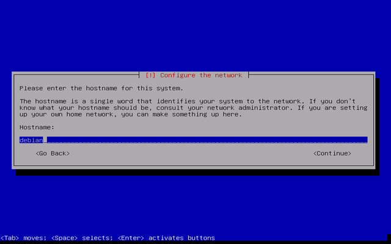

# Debian

Debian kurulum cdsini boot ettikten sonra karşımıza gelen ekranda "Install Debian" seçeneğini tıklıyoruz.

Yükleme esnasındaki dil paketini seçiyoruz.

Konumumuzu bildiriyoruz.

Debianda Türkiye ile uyuşan herhangi bir dil paketi bulunmamakta. Bu yüzden UTF-8 formatındaki United States seçeneğini isaretliyoruz.

Bu ekranda ağ ayarlarını yapabileceğiniz gibi, daha sonradan ayarlamak üzere geçebilirsiniz.

Hostname ayarlamamızı yapıyoruz. Sonraki gelen müteakip adımlarda ise sifremizi giriyoruz. Debian bu asamadan sonra sizden kullanıcı açmanızı isteyecek, bunlar admin,root veya user'dan farklı olmalıdır.

Sonraki aşamada ise diskimizin bölümlerini ayarlıyoruz. Buradaki bölümlemeler

