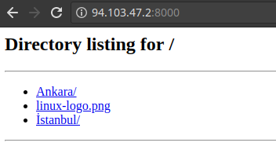

# Python ile Dosya Sunuculuğu

Eğer dosya transferi yapmak istediğiniz tarafın teknik araçlara erişimi yetersizse, birden fazla kişiye dosya sunmak isterseniz, dosyayı alacak kişilerin sadece internet tarayıcısı kullanarak sunucunuz üzerindeki herhangi bir klasöre erişmelerini sağlayabilirsiniz.

Bunun için Python'dan faydalanacak olmamıza rağmen, derinlemesine Python bilgisine ihtiyaç yoktur. Python'un kendi içinde gelen basit bir HTTP sunucu modülü bulunur.

**Python 3 (Önerilen):**

Modern sistemlerde genellikle Python 3 kurulu gelir. Python 3'te bu modül `http.server` olarak adlandırılır. Örneğin `/root/resimler` dizinini (ve alt dizinlerini) HTTP üzerinden sunmak için, ilgili dizine gidip aşağıdaki komutu çalıştırmak yeterlidir:

```bash
[root@emre ~]# cd /root/resimler
[root@emre resimler]# python3 -m http.server
Serving HTTP on 0.0.0.0 port 8000 (http://0.0.0.0:8000/) ...
```
(Eğer sisteminizde `python3` yerine sadece `python` komutu Python 3'ü çalıştırıyorsa, `python -m http.server` kullanın.)

**Python 2 (Eski Sistemler):**

Python 2 (artık desteklenmiyor) kullanan eski sistemlerde ise modül adı `SimpleHTTPServer` idi:

```bash
[root@emre ~]# cd /root/resimler
[root@emre resimler]# python -m SimpleHTTPServer
Serving HTTP on 0.0.0.0 port 8000 ...
```

Her iki durumda da, sunucunun çalıştığı makinenin IP adresine ve varsayılan olarak 8000 numaralı porta bir web tarayıcısı ile bağlanarak dizin içeriğine erişilebilir (örneğin, `http://SUNUCU_IP_ADRESI:8000`).



Eğer 8000 dışında farklı bir port kullanmak isterseniz, port numarasını komutun sonuna ekleyebilirsiniz:

```bash
# Python 3
[root@emre resimler]# python3 -m http.server 9001
Serving HTTP on 0.0.0.0 port 9001 (http://0.0.0.0:9001/) ...

# Python 2
[root@emre resimler]# python -m SimpleHTTPServer 9001
Serving HTTP on 0.0.0.0 port 9001 ...
```
**Güvenlik Uyarısı:** Bu basit HTTP sunucusu, herhangi bir kimlik doğrulama veya güvenlik önlemi sunmaz. Sadece güvenli ağlarda, geçici dosya paylaşımları için kullanılmalıdır. Hassas verileri bu yöntemle paylaşmaktan kaçının.

Kopyalama işlemleri tamamlandıktan sonra, güvenlik gereği Python programını öldürmeniz gerekecektir. Bunu ister **kill** ile, ister **CTRL+C** ile _interrupt_ göndererek yapabilirsiniz.
