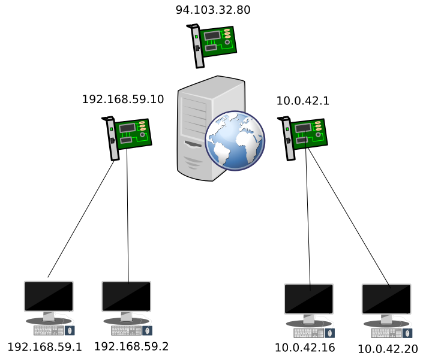

# route

```route``` komutu da ```ifconfig``` gibi artık desteklenmeyen komutlar arasındadır. Yerin ```ip``` komutunun route parametresi kullanılmalıdır.

## Mevcut Route Tablosunu Görmek

Komutu doğrudan çalıştırdığınızda route tablosunu gösterir.

```bash
eaydin@dixon ~ $ route
Kernel IP routing table
Destination     Gateway         Genmask         Flags Metric Ref    Use Iface
default         192.168.99.1    0.0.0.0         UG    0      0        0 wlan0
172.16.77.0     *               255.255.255.0   U     0      0        0 vmnet1
172.16.148.0    *               255.255.255.0   U     0      0        0 vmnet8
192.168.99.0    *               255.255.255.0   U     9      0        0 wlan0
```

```-n``` parametresiyle adreslerin nümerik değerleri gösterilir.

```bash
eaydin@dixon ~ $ route -n
Kernel IP routing table
Destination     Gateway         Genmask         Flags Metric Ref    Use Iface
0.0.0.0         192.168.99.1    0.0.0.0         UG    0      0        0 wlan0
172.16.77.0     0.0.0.0         255.255.255.0   U     0      0        0 vmnet1
172.16.148.0    0.0.0.0         255.255.255.0   U     0      0        0 vmnet8
192.168.99.0    0.0.0.0         255.255.255.0   U     9      0        0 wlan0
```

Linux çekirdeği daha hızlı routing (yönlendirme) yapabilmek için bir routing cache tutar. Cache değerlerini görmek için ```route -Cn``` komutunu kullanabilirsiniz.

## Route Tablosuna Müdahale Etmek
Route tablosuna yeni bir gateway eklenebilir, silinebilir veya bazı yollar engellenebilir. Bu bölümde örneklerini inceleyeceğiz.

### Default Gateway Eklemek

Belirli bir ağ aralığında (network range) bulunmayan paketler default gateway'e yönlenir. Örneğin yukarıdaki routing tablosunda, 172.16.77.0/24, 172.16.148.0/24 ve 192.168.99.0/24 dışındaki adreslere yönlendirilecek bütün paketler, 192.168.99.1 adresine gönderilir. Burası bulunduğumuz ağdaki router'dır, kendisi de gelen paketleri Internet Servis Sağlayıcıya iletir. Default gateway'in kendisi olduğunu, **Flags** kolonundaki **G** ifadesi belirtmektedir.

```bash
route add default gw 192.168.99.5
```

### Default Gateway Silmek

Default Gateway'in, "nereye gideceğini bilmediğimiz paketlerin gönderildiği yer" olduğunu öğrendik. Öyleyse sistemimizde sadece bir tane default gateway olabilir. Bu durumda default gateway'i silmek için aşağıdaki komutu kullanabiliriz.

```bash
route del default
```

**NOT:** Bazı durumlarda sistemde birden fazla default gateway tanımlanabilir. Teorik olarak gerekmiyor olsa da pratikte nadiren rastlanılan bir durumdur. Bu özel durumlar kapsamımız dışında olduğundan incelemiyoruz. Sadece böyle senaryoların karşılaşılabildiğini belirtme ihtiyacı hissettik.

### Gateway Eklemek

Default olmayan gateway, bir IP aralığına karşılık geldiği için, IP adresi, netmask ve NIC belirtmek gerekir.

```bash
route add -net 192.168.59.128 netmask 255.255.255.128 eth0
```

Yukarıdaki komut, **192.168.59.128-192.168.59.255** aralığıdaki IP'lere gönderilecek paketlerin **eth0** cihazı üzerinden yollanacağını belirtir.

Bu satırı yazdıktan sonra önceki route tablomuz şöyle oldu:

```bash
eaydin@dixon ~ $ route -n
Kernel IP routing table
Destination     Gateway         Genmask         Flags Metric Ref    Use Iface
0.0.0.0         192.168.99.1    0.0.0.0         UG    0      0        0 wlan0
172.16.77.0     0.0.0.0         255.255.255.0   U     0      0        0 vmnet1
172.16.148.0    0.0.0.0         255.255.255.0   U     0      0        0 vmnet8
192.168.59.128  0.0.0.0         255.255.255.128 U     0      0        0 eth0
192.168.99.0    0.0.0.0         255.255.255.0   U     9      0        0 wlan0
```
### Gateway Silmek

Yukarıda eklediğimiz gateway'i silmek için

```bash
route del -net 192.168.59.128 netmask 255.255.255.128 eth0
```

### Bir IP veya Ağı Engellemek

Belirli bir IP'ye gidecek paketleri route tablosundan engelleyebilirsiniz.

```bash
route add -host 192.168.59.5 reject
```

```bash
eaydin@dixon ~ $ ping 192.168.59.5
connect: Network is unreachable
eaydin@dixon ~ $ route -n
Kernel IP routing table
Destination     Gateway         Genmask         Flags Metric Ref    Use Iface
0.0.0.0         192.168.99.1    0.0.0.0         UG    0      0        0 wlan0
172.16.77.0     0.0.0.0         255.255.255.0   U     0      0        0 vmnet1
172.16.148.0    0.0.0.0         255.255.255.0   U     0      0        0 vmnet8
192.168.59.5    -               255.255.255.255 !H    0      -        0 -
192.168.99.0    0.0.0.0         255.255.255.0   U     9      0        0 wlan0
```

Engellemeyi kaldırmak için

```bash
route del -host 192.168.59.5 rejec
```

Tek IP'yi engellemek yerine bir ağ aralığını engelleyebiliriz.

```bash
route add -net 192.168.59.0 netmask 255.255.255.0 reject
```

```bash
eaydin@dixon ~ $ route -n
Kernel IP routing table
Destination     Gateway         Genmask         Flags Metric Ref    Use Iface
0.0.0.0         192.168.99.1    0.0.0.0         UG    0      0        0 wlan0
172.16.77.0     0.0.0.0         255.255.255.0   U     0      0        0 vmnet1
172.16.148.0    0.0.0.0         255.255.255.0   U     0      0        0 vmnet8
192.168.59.0    -               255.255.255.0   !     0      -        0 -
192.168.99.0    0.0.0.0         255.255.255.0   U     9      0        0 wlan0
```

Engellemeyi kaldırmak için

```bash
route del -net 192.168.59.0 netmask 255.255.255.0 reject
```

## IP Temelli Gateway Eklemek

Yukarıdaki örneklerde belirli ağ aralığındaki paketleri eth0 gibi bir cihaza yönlendirmiştik. Aşağıdaki örnekte, belirli IP aralığındaki paketleri, bir IP adresi ile tanımlanmış gateway'e yönlendireceğiz.

```bash
route add -net 192.168.55.0 netmask 255.255.255.0 gw 192.168.55.1
```

Bu tanıma göre artık 192.168.55.0/24 ağ aralığına gidecek bütün paketler 192.168.55.1 IP adresine yönlendirilecektir.


# Örnek Route Senaryosu

Aşağıdaki örneği dikkate alalım. **VT** isminde bir sunucumuz olsun. Üzerinde 3 tane ethernet kartı var, ikisi farklı yerel ağ'lara bağlı, biriyse internete çıkıyor. **VT** sunucumuz, bu iki ağı hem birbiriyle, hem de internetle konuşturmak istiyor. Senaryo aşağıdaki gibi olsun:



Yukarıdaki senaryoda, VT sunucumuzun 3 IP adresi olacaktır. 192.168.59.10 ve 10.0.42.1 IP adresleri yerel ağları yönetecek, 94.103.32.80 IP adresi ise internete çıkışını sağlayacaktır.

Bu senaryoda, 192.168.59.0/24 bloğundaki cihazların (teknik ekip), 10.0.42.0/24 bloğundaki cihazlarla (muhasebe ekibi), ve internetin geri kalanıyla haberleşebilmesini sağlamak gerekiyor.

## Uçbirimlerin Gateway Ayarlaması

Öncelikle uçbirimlerin default gateway'leri ayarlanmalıdır. 192.168.59.0/24 bloğundaki cihazların gatewayleri 192.168.59.10 yapılmalıdır. Öyleyse bu bloktaki bilgisayarlara aşağıdaki komut yazılır.

```bash
route add default gw 192.168.59.10
```

Benzer şekilde 10.0.42.0/24 bloğundaki cihazlar da kendi gateway'ini öğrenemli. Bu durumda muhasebe ekibinin bilgisayarlarında aşağıdaki komut çalıştırılır.

```bash
route add default gw 10.0.42.16
```

## VT Makinasında Teknik Grubun Route Kuralı

VT makinası, kendisine 192.168.59.0/24 ağına gitmek üzere gönderilen paketleri hangi IP'ye (192.168.59.10) göndereceğini bilmelidir. Bunun için aşağıdaki route kura VT makinasında yazılır.

```bash
route add -net 192.168.59.0 netmask 255.255.255.0 gw 192.168.59.10
```
## VT Makinasında Muhasebe Grubunun Route Kuralı

Benzer şekilde, VT makinasının 10.0.42.0/24 ağına gönderilecek paketleri hangi IP'ye (10.0.42.1) yönlendirmesi gerektiği belirtilmelidir.

```bash
route add -net 10.0.42.0 netmask 255.255.255.0 gw 10.0.42.1
```


