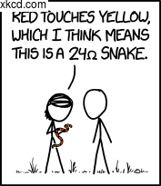

# Imagemagick ve Görüntü Dosyaları

GNU/Linux komut satırında birden görüntü dosyası üzerinde işlem yapmak için en uygun paketlerden birisi **imagemagick** paketidir. İçerisinde temel işlemleriniz için pek çok araç barındırır.

## Tip Dönüşümü

Örneğin dosya uzantılarından dosya tiplerini anlayacağı için, doğrudan png->jpg dönüşümü gibi işlemler yapabilirsiniz. Ayrıca kalite belirterek dosyanın kayıplı sıkıştırma miktarını belirleyebilirsiniz.

```bash
convert logo.png logo.jpg
convert logo.png -quality 70 logo.jpg
```

## Boyut Dönüşümü

Imagemagick ile dosya boyutlarını değiştirmek kolaydır.

```bash
convert logo.jpg -resize 300x120 logo.jpg
```

Yukarıdaki komut, görüntü oranını (aspect ratio) korur. Yani görüntüyü 300x120'lik bir dikdörtgen içerisine sığdırmaya çalışır. Eğer korumasını istemiyorsanız ve oran bozulsa bile tam olarak 300x120'lik çıktı elde etmek istiyorsanız bunu ünlem (!) koyarak belirtebilirsiniz.

```bash
convert logo.jpg -resize 300x120! logo.jpg
```

Tabii oran korunarak boyutlandırma için sadece genişlik (width) veya yükseklik (height) belirtebilirdik.

```bash
convert logo.jpg -resize 300 logo.jpg
convert logo.jpg -resize x120 logo.jpg
```

Ayrıca yüzde belirterek küçültme işlemleri de yapılabilir.

```bash
convert logo.jpg -resize 50% logo.jpg
```

### Sadece Küçült
Imagemagick ile sadece belirli boyuttan büyük olanları küçültmek için kullanılabilecek bir işaretçi var, büyüktür **>** işareti. Alışıla geldiğin tersinde bir gösterim ancak bunu şu şekilde okumak gerekir: "Sadece bu boyuttan **büyük** olan dosyalarda çalış".

```bash
convert logo.jpg -resize 128x128\> logo_thmb.jpg
```

### Sadece Büyüt
Yukarıdaki işlemin tam tersidir. Eğer dosya belirtilen limitlerden küçükse çalışır.

```bash
convert logo.jpg -resize 128x128\< logo_large.jpg
```

## Döndürme İşlemleri

Imagemagick ile görüntüyü döndürmek tahmin edileceği gibi **rotate** ile yapılır.

```bash
convert logo.jpg -rotate 90 logo.jpg
```
 


## Aynalama İşlemleri

Öte yandan aynalama işlemleri için **flip** ve **flop** seçenekleri kullanılır. **flip** görüntüyü başaşağı çevirir (x-ekseninde aynalama), **flop** ise soldan sağa doğru (y-ekseninde) çevirir.

```bash
eaydin@dixon ~/calisma/im $ convert 1604.png -flip flipped.png
eaydin@dixon ~/calisma/im $ convert 1604.png -flop flopped.png
eaydin@dixon ~/calisma/im $ convert 1604.png -flip -flop flipflop.png
```

   

## Filtreler

Programın bir çok filtresi bulunuyor. Tamamının üzerine geçmek bu kitabın amacının çok dışında olacaktır dolayısıyal sadece birkaç örnek ile sonuçlarını göstermek istedik.
```bash
eaydin@dixon ~/calisma/im $ convert 1604.png -radial-blur 20 blurred.png
```


```bash
eaydin@dixon ~/calisma/im $ convert 1604.png -charcoal 4 charcoal.png
```


## Görüntü Hakkında Bilgi Almak

Yukarıdaki komutların tamamında birtakım işlemler yaptık ancak görüntü dosyası hakkında hiç bilgi almadık. Bunun için **identify** komutu kullanılabilir.

```bash
eaydin@dixon ~/calisma/im $ identify 1604.png 
1604.png PNG 177x205 177x205+0+0 8-bit DirectClass 32.9KB 0.000u 0:00.000
```

Dosya hakkında çok detaylı bilgi almak isterseniz **-verbose** seçeneğini kullanabilirsiniz. (Burada çıktıyı göstermiyoruz çünkü oldukça uzun)

```bash
identify -verbose 1604.png
```

## Watermark Eklemek

Görüntülere kaynağını belirten birtakım ifadeler ekleyebilirsiniz. Bu kısımda watermarking yöntemlerini inceleyeceğiz.

En kolay yöntem, pek çok internet sitesinde gördüğünüz gibi, görüntünün köşesine bir not eklemektir.

```bash
eaydin@dixon ~/calisma/im $ composite label:"xkcd.com" 1604.png labelled.png
```



Öte yandan etiketimizi görüntünün altına yayılacak şekilde yerleştirebilirdik.

```bash
eaydin@dixon ~/calisma/im $ convert 1604.png -background Green label:'xkcd.com' -gravity center -append center-labelled.png
```


