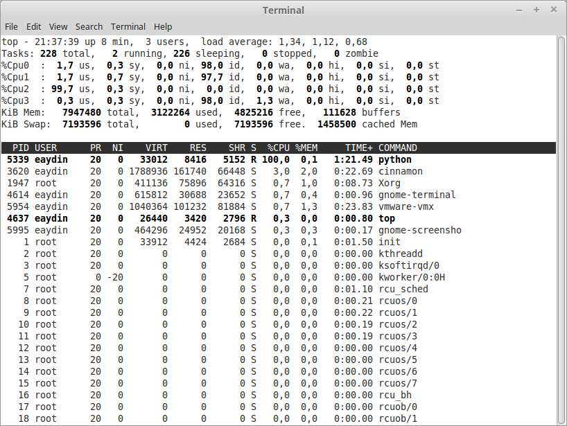
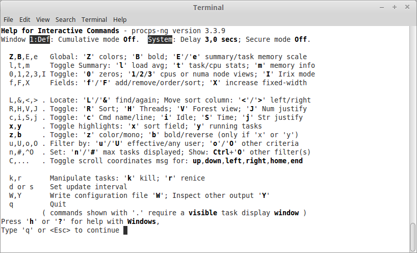

# top, ps ile İşlem İzleme

Linux üzerinde sistem kaynaklarınızı tüketen yazılımları izlemek için kullanılan en pratik programlardan birisi **top** programıdır. Program doğrudan CPU kullanımına göre sıralandırılmış sonuçlar döndürür.

*top ekranı*

Sisteminizdeki bütün CPU'ların işlem miktarını görmek için **1** tuşuna basılabilir.

*Bütün CPU'ları gösteren top ekranı*

CPU kullanımı incelenirken dikkat edilmesi gereken nokta, toplam değeri %100'ün üzerinde olmasının mümkün olduğudur Örneğin yukarıdaki örnekte kullandığımız sistemin 4 tane CPU'su bulunduğundan, toplam değer %400 olabilir. Bazı durumlarda bir CPU'nun %100'ün üzerinde değer vermesi mümkündür, bu *top* programının işlemci kullanımını tespit ederkenki hassasiyetiyle ilgilidir.

**h** tuşuna basılarak programın yardım ekranına erişilebilir.

