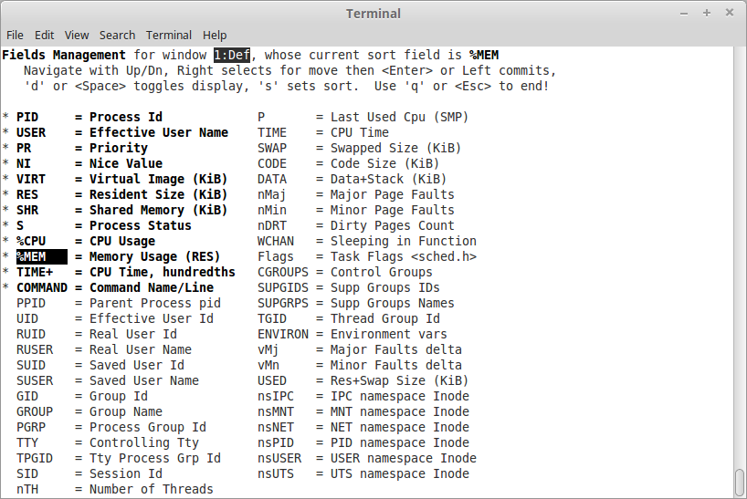
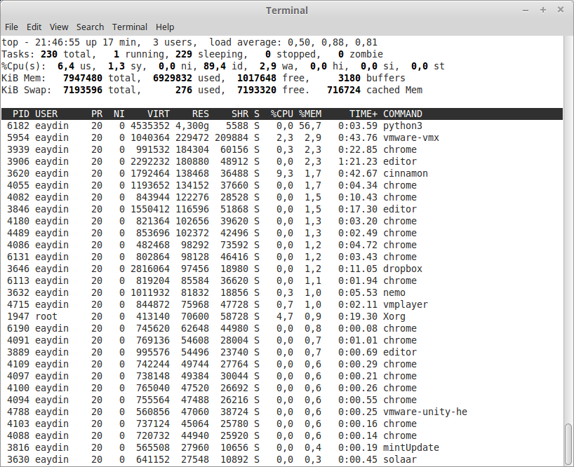
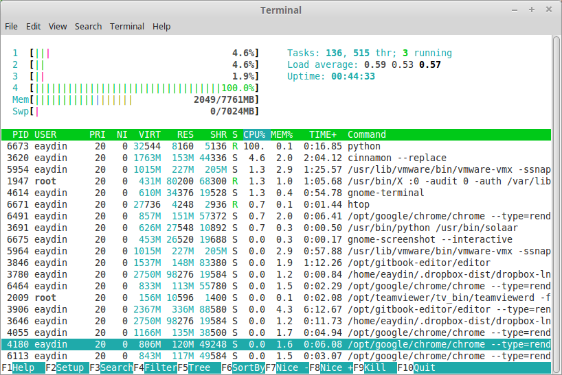
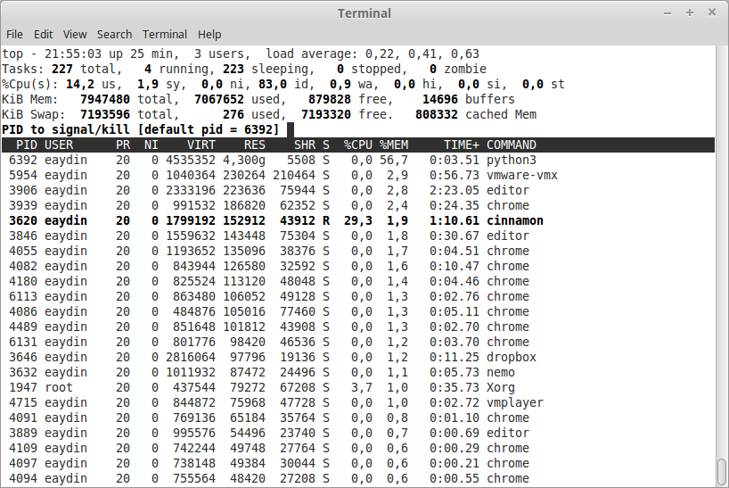

# Sistem Yükünü İzleme

##top

Linux üzerinde sistem kaynaklarınızı tüketen yazılımları izlemek için kullanılan en pratik programlardan birisi **top** programıdır. Program doğrudan CPU kullanımına göre sıralandırılmış sonuçlar döndürür.


*top ekranı*

Sisteminizdeki bütün CPU'ların işlem miktarını görmek için **1** tuşuna basılabilir.


*Bütün CPU'ları gösteren top ekranı*

CPU kullanımı incelenirken dikkat edilmesi gereken nokta, toplam değeri %100'ün üzerinde olmasının mümkün olduğudur Örneğin yukarıdaki örnekte kullandığımız sistemin 4 tane CPU'su bulunduğundan, toplam değer %400 olabilir. Bazı durumlarda bir CPU'nun %100'ün üzerinde değer vermesi mümkündür, bu *top* programının işlemci kullanımını tespit ederkenki hassasiyetiyle ilgilidir.

**h** tuşuna basılarak programın yardım ekranına erişilebilir.


Yukarıdaki yardım ekranından görülebileceği gibi, top ekranındaki değerleri sıralamak için **f** tuşu kullanılabilirmiş.


*Hangi parametreye göre sıralanacağını gösteren ekran.*

Yukarıdaki ekrandan **memory** seçerek **top** programının bellek tüketimine göre programları sıralaması sağlanabilir. Ardından **q** ile çıktığımızda ekranımız aşağıdakine benzer olacaktır.


*Yukarıdaki örnekte python3 belleğin büyük çoğunluğun tüketirken görülüyor.*

**top** programının renklendirilmiş ve daha kolay kullanılır hale getirilmiş bir versiyonu **htop** bazı sistemlerde bulunabilir. Daha kolay kullanım ve daha alışıldık bir görünüm sağlar.


*htop ekran görüntüsü*

##free

Sistemin genel bellek tüketimini görmek için **free** komutu kullanılabilir.

```bash
free
             total       used       free     shared    buffers     cached
Mem:       7947480    7095948     851532     482716       6864     781848
-/+ buffers/cache:    6307236    1640244
Swap:      7193596        276    7193320
```

##kill

**top** kullanılırken işlemleri öldürmek mümkündür. Ekranda **k** tuşuna bastığınızda, doğrudan en üstteki işlem seçilecektir. Bunun dışında bir işlem öldürülmek istenirse, ilgili işlemin PID'si yazılabilir. Ardından hangi sinyal ile öldürüleceği belirtilmelidir. Genel kanı **15** sinyali ile öldürmektir.



Aslında top programı arka planda aşağıdaki komutu çalıştırır.

```bash
kill -15 6392
```

**15** numaralı sinyal, aslında programa **TERMINATION** sinyalini gönderir. Doğru yazılmış programlar bu sinyali işleyip kapanmaya çalışırlar. Örneğin açık dosyalarını kapatır, gerekli işlemlerini tamamlar vs. Eğer bir program bu sinyal ile ölmüyorsa, muhtemelen işlemleri arasında bir problem yaşamış demektir. Bu programları sonlandırmak için **KILL** sinyalini **9** ile göndermek gerekir. Bu sinyal her ne olursa olsun programın sonlandırılmasını sağlayacaktır.

Sistem üzerinde pek çok sinyal bulunur. Sinyallerin bir listesini görmek için ```kill -l``` komutu kullanılabilir. Örneğin **2** numaralı sinyal, **INTERRUPT** sinyalidir, kısacası bir program çalışırken klavyenizle **CTRL+C** göndermekle aynı işi yapar. Bazı durumlarda bu sinyali göndermek, veya programlarınız test etmek için yararlı olabilir.

Bir diğer örnek Hang Up (HUP) sinyalidir. **1** numaralı sinyal olan HUP, pek çok *daemon* tarafından *restart* olarak işlenir. Örneğin *apache* bu sinyali alıp işleyen servislerden birisidir. Apache'nin PID'sine *HUP* sinyali gönderilirse, Apache kendisini yeniden başlatır.

##uptime

Sistem hakkında bilgi edinmeyi sağlayan bir diğer komut **uptime** komutudur. Sistemin ne kadar zamandır çalıştığını, kaç kişinin (terminalin) açık olduğunu, son birkaç dakikanın işlemci yükünün ortalamasını gösterir.

Sistemin ne zaman başlatıldığını görmek için ```who -b``` komutu da oldukça faydalıdır.

Öte yandan sisteme bağlı terminallerin bir listesini elde etmek için `w` programı kullanılabilir.

##ps

**ps** programı sistem üzerinde çalışan yazılımları, işlemleri tespit etmek için kullanılır. Yaygınlıkla kullanılan parametreler ```ps aux``` ve ```ps -ef``` şeklindedir. Bu parametreler ile işlemleri listeleyip, farklarına bakabilirsiniz. İşlemler listesinin başını görmek için çıktınızı ```head``` ile sınırlandırın, veya ```more``` ile sayfalara bölün.

İşlemlerin hiyerarşilerini görebilmek için ```ps axjf``` kullanılabilir. Böylece hangi işlemin, hangisinin **parent**ı olduğu görülebilir. Linux üzerinde her zaman 1 numaralı **PID**'ye (Process ID) sahip işlem *init*tir. Bütün işlemler bu program tarafından **spawn** edilir. Linux'ta bir işlemin **parent** işlemini öldürdüğünüzde, **child** işlemleri de ölecektir. Dolayısıyla örneğin bir şekilde **1** numaralı işlemimiz ölürse, bütün sistem duracaktır. Bu durumun önüne geçebilmek için *init* işlemi sistem tarafından korunur. *init* kendisine hangi sinyallerin gönderilebileceğine karar verir. Bu, yazılan Linux çekirdeklerine göre değişiklik gösterebilir, ancak hemen hepsi **kill** sinyaline izin vermez.

##nice

Linux üzerinde işlemlerin önceliği, onların ne kadar *nice* (iyi) olduklarıyla ifade edilir. Bir işlemin *nice* değeri ne kadar düşükse, o kadar "az iyi" olacağından, o kadar işlemci önceliği vardır, yani daha fazla sistem kaynağı tüketen işlemlerin *nice* değeri düşüktür. Önceliği düşük olan işlemleri daha *iyi*dir çünkü daha az sistem kaynağı tüketirler.

**top** komutu çıktısındaki **NI** sütunu, ilgili işlemin *nice* değerine karşılık gelir.

*nice* değeri -19/-20 ile 19/20 arasında değişebilir. Üst ve alt limitlerin değeri sistemlere göre farklılık gösterir.

Bir programı belirli bir *nice* değeri ile çalıştırmak istersek, programı çalıştırma esnasında bu değeri belirtmek gerekir.

```bash
nice -n 12 crc8
```

Öte yandan, mevcut bir programın *nice* değerini değiştirmek istersek, programın **PID** değerini parametre olarak vermek gerekir.

```bash
renice -3 5486
```