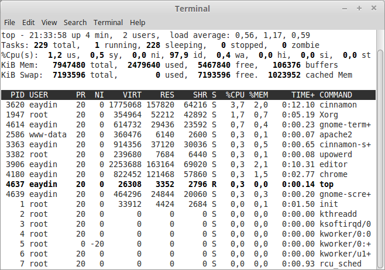

# top, ps ile İşlem İzleme

Linux üzerinde sistem kaynaklarınızı tüketen yazılımları izlemek için kullanılan en pratik programlardan birisi **top** programıdır. Program doğrudan CPU kullanımına göre sıralandırılmış sonuçlar döndürür.


*top ekranı*

Sisteminizdeki bütün CPU'ların işlem miktarını görmek için **1** tuşuna basılabilir.


*Bütün CPU'ları gösteren top ekranı*

CPU kullanımı incelenirken dikkat edilmesi gereken nokta, toplam değeri %100'ün üzerinde olmasının mümkün olduğudur Örneğin yukarıdaki örnekte kullandığımız sistemin 4 tane CPU'su bulunduğundan, toplam değer %400 olabilir. Bazı durumlarda bir CPU'nun %100'ün üzerinde değer vermesi mümkündür, bu *top* programının işlemci kullanımını tespit ederkenki hassasiyetiyle ilgilidir.

**h** tuşuna basılarak programın yardım ekranına erişilebilir.


Yukarıdaki yardım ekranından görülebileceği gibi, top ekranındaki değerleri sıralamak için **f** tuşu kullanılabilirmiş.


*Hangi parametreye göre sıralanacağını gösteren ekran.*

Yukarıdaki ekrandan **memory** seçerek **top** programının bellek tüketimine göre programları sıralaması sağlanabilir. Ardından **q** ile çıktığımızda ekranımız aşağıdakine benzer olacaktır.


*Yukarıdaki örnekte python3 belleğin büyük çoğunluğun tüketirken görülüyor.*

Sistemin genel bellek tüketimini görmek için **free** komutu kullanılabilir.

```bash
free
             total       used       free     shared    buffers     cached
Mem:       7947480    7095948     851532     482716       6864     781848
-/+ buffers/cache:    6307236    1640244
Swap:      7193596        276    7193320
```


