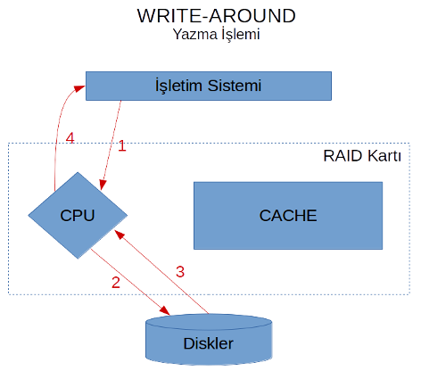
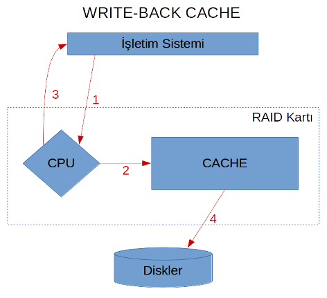
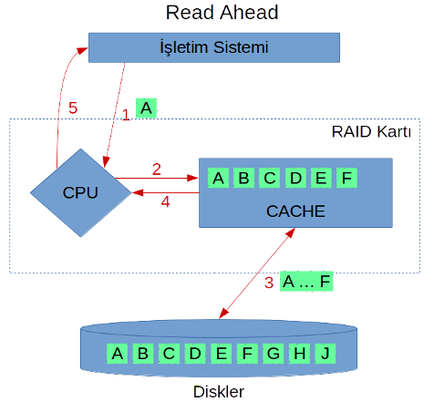

# Cache

RAID kontrol kartları tıpkı küçük birer bilgisayar gibi çeşitli bileşenlerden oluşurlar. Bunlar arasında bir işlemci ve bir tampon bellek (_cache_) de bulunur. Söz konusu tampon bellek, standart diskler kadar yavaş değildir, üzerinde çok daha küçük bir alan bulunur ancak bu bölgeye veri yazıp okumak çok daha hızlı olur. Verilerin yazılma ve okunma işlemlerinde performans kazancı sağlamak için RAID kartı bu tampon belleği kullanır, ancak bu bölgeyi kullanma stratejisi farklılıklar gösterebilir. RAID kartının tampon belleği kullanma stratejisi sistemden beklenen güvenilirlik seviyesinden, okuma/yazma işlemlerinin yoğunluğunun oranına, sıralı veri okuma ihtiyacının olup olmayışından yazılan verinin yakın zamanda okunup okunmayacağına göre değişkenlik gösterir. Bu ihtiyaçlara yönelik hemen her RAID kartı üreticisinin desteklediği ortak stratejiler bulunur ve bunlara RAID Cache Mekanizmaları (_RAID Caching Mechanisms_) denilebilir.

## Write-Through Cache

Aslında ismi hemen hemen ele veriyor kendisini. Bu mekanizma, yazma işlemlerinin tamamının _cache aracılığıyla_ yapılacağını belirtir. Kısacası veriyi RAID kartı önce cache'ye yazar, ardından disklere yazar. Disklere yazma işlemi tamamlandıktan sonra veriler cache'den silinmez, ve işletim sistemine "yazma işlemini bitirdim" sinyali gönderilir.

Yukarıdaki şekilde gerçekleşen adımlar aşağıdaki gibidir:

1. İşletim sistemi bir veriyi yazmak istediğini RAID kartına söyler. RAID kartı bunu kendi üzerindeki CPU'ya yönlendirir.
2. CPU yazma işlemini Cache'ye yapar.
3. Cache'ye yazma işlemi tamamlandıktan sonra, Cache'deki bu yeni veri Disklere yazılır.
4. Diskler yazma işlemini tamamladığı sinyalini RAID kartına yönlendirir.
5. RAID kartı yazma işleminin tamamlandığını işletim sistemine bildirir.

Burada önemli olan nokta, yazılan verinin hala Cache'de olmasıdır. Bu işlemin ardından, eğer işletim sistemi bir okuma isteği gönderirse, ve okumak istediği veriler "henüz yeni cache'ye yazılmış veriler"se, o zaman okuma işleminde ciddi hız kazancı sağlanır.

Yukarıdaki şekil, yazma işlemi gerçekleştirildikten sonra, işletim sisteminin "biraz önce yazılan veriyi" istediği takdirde izleyeceği yolları göstermektedir. Kırmızı oklar yazma işlemi, yeşil oklar ise okuma işlemini göstermektedir. Buradan görüleceği üzere, yeni yazılan veri hala cache üzerinde olduğu sürece, okuma işleminde disklere ihtiyaç olmayacaktır. Bu durum çok ciddi bir performans artışına sebep olur. Ancak istenilen verinin cache'de olmaması durumunda tabii ki disklerden veri okunacaktır.

Write-Through Cache'leme mekanizması

## Write-Around Cache

Bu mekanizma da yine adından anlaşılabileceği üzere, yazma işlemlerinde "cache'nin etrafından dolanmaktadır". Kısacası yazma işlemleri cache kullanılmadan yapılmakta, ancak (eğer ayarlanmışsa) okuma işlemlerinde cache kullanılmaktadır. Bu durum özellikle okumanın yoğun olduğu sistemlerde verimli olabilir, çünkü cache'nin tamamı okuma işlemine ayrılmış olur. Ancak burada okunan verinin henüz yazılmış veri olmaması gerekmektedir. Eğer yeni yazdığımız veriyi okuyacaksak, bu verinin cache'de kalması hızlı erişim için ciddi avantajlar sağlar.

Yukarıdaki örnekte gerçekleşen adımlar şu şekildedir:

1. İşletim sistemi yazma isteğini RAID kartına iletir.
2. RAID kartı CPU'su gelen veriyi doğrudan diske yazar.
3. Disk, yazma işleminin tamamlandığını RAID kartına bildirir.
4. RAID kartı yazma işleminin tamamlandığını işletim sistemine bildirir.

Görüldüğü üzere, cache hiç kullanılmamıştır. Dolayısıyla ilk yazma işleminde cache boş olacaktır. Şimdi bu senaryoda veri okunacağı zaman gerçekleşecek işlemlere bakalım.

1. İşletim sistemi okuma isteğini RAID kartına gönderir.
2. RAID kartı ilgili bloğun cache'de olup olmadığını kontrol eder.
3. Cache, üzerinde bu bilgi olmadığı için disklerden okur ve cache'ye yazar.
4. Cache okunan bilginin kopyasını CPU'ya iletir.
5. RAID kartı işletim sistemine bilgiyi iletir.

Bu işlemler sonucunda, cache'de artık bir miktar veri bulunmaktadır. Bundan sonra tekrar işletim sistemi istek gönderdiğinde, eğer ilgili veri biraz önce cache'ye yazılan veriyse, okuma işlemi hızlanacaktır.

Görüldüğü üzere, tekrar okuma işleminde (eğer daha önce okunan veri talep edilmişse) disklere gerek kalmaz.

## Write-Back Cache

Cache mekanizmaları arasındaki en verimli, ancak en güvensiz yöntemlerden birisidir. Bu yöntem temel olarak RAID kartının cache'sine güvenir, ve gelen yazma isteğini cache'ye yazmayı tamamladığı anda işletim sistemine "yazmayı tamamladım" sinyalini gönderir. Ardından cache'deki veriyi disklere yazma işlemini gerçekleştirir.

1. İşletim sistemi yazma talebini RAID kartına gönderir.
2. CPU yazılacak bilgiyi cache'ye yazar.
3. RAID kartı işletim sistemine "verileri diske yazdım" sinyali gönderir.
4. RAID kartı cache'deki veriyi disklere yazar.

Bu mekanizmanın avantajı ortada, işletim sistemi açısından yazma işlemi son derece hızlı gerçekleşir çünkü RAID kartının cache'sine yazma hızı kendisi için limit olur. Eğer İşletim sisteminin yazma talepleri, cache ile diskler arasındaki bağlantının yetişemeyeceği hıza çıkarsa, cache'nin dolmasından dolayı performans en fazla Write-Through Cache mekanizmasında olduğu haline kadar gerileyebilir.

Bu mekanizma çok uygun görünse de, verinin disklere güvenli bir biçimde yazılmadan önce işletim sisteminin verinin yazdığını varsaymasını sağlar. Eğer cache'deki veri tamamen disklere yazılmadan önce sistemin elektiriği kesilirse, cache üzerindeki veri disklere aktarılamayacaktır. Bu durum ciddi veri kayıplarına neden olur.

RAID kartı ve benzeri kartlardaki cache tampon bellekleri genellikler bilgisayarların RAM'lerine benzer yapıya sahiptirler. Bu tip belleklere _kırılgan_ oldukları için _volatile memory_ denilir. Sisteme elektrik sağlandığı takdirde bellekteki veriler güvendedir, ancak elektrik kesildiği anda bellekteki veriler tamamen kaybolur. Bu tip belleklerin son derece hızlı olmasının yanında getirdiği bir dezavantajdır. Özellikle RAID kartlarında cache üzerindeki elektiriğin kesilmesi durumunda bütün sistemi etkileyecek veri kayıplarına neden olacağı için, bu tip kartlara pil konulur. Olası bir elektrik kesintisinde pil cache'yi besler, böylece cache üzerindeki veriler _pilin ömrü yettiği sürece_ silinmez. RAID kartı sisteme yeniden elektrik verildiğini tespit ettiği takdirde cache'deki verileri disklere yazmaya çalışır, böylece veri kaybı yaşanmaz.

Bu senaryo her ne kadar ideal gibi görünse de, bütün şartlar beklendiği gibi olmamaktadır. Bazı durumlarda pilin ömrü çok kısa olabilmekte, bazen sistem yeniden ayağa kalktığında işletim sistemi çok fazla disk okuma/yazma işlemine ihtiyaç duyduğu için darboğazlara sebep olabilmektedir. Ayrıca beklenmedik elektrik kesintileri en çok disklere zarar vermektedir. Disklerin elektrik kesintisi sonucu kurtarılamaz durumda zarar görmesi rastlanan durumlardandır.

Özellikle RAID kartındaki pilin kullanımı konusunda kart üreticileri çeşitli yöntemler geliştirmiştir. Örneğin çoğu üretici write-back mekanizmasını desteklediği halde, RAID kartının pili olmaması durumunda bu özelliği kullanılmaz hale getirmekte ve write-through modunda çalışmaktadır. Bazı üreticilerse pilin kalan ömrünü ölçüp, eğer elektrik kesintisinde 24 saat dayanabilecek durumda değilse write-back mekanizması devredışı bırakmaktadır.

## Read Ahead Cache

Bu cache'leme stratejisi yazma ile ilgili değil, okuma işlemleri ile ilgilidir. Normal şartlar altında işletim sistemi bir _parçanın_ okunmasını talep ettiğinde, RAID kartı ilgili veriyi disklerden okuyup cache'ye yazar, sonra işletim sistemine sunar. İşletim sistemi tekrar aynı veriyi isterse, bu verinin cache'de olması durumunda diskleri tekrar kullanmayıp cevap vermiş olur. Bu haliyle aslında read ahead yapmamış olur. Genellikle RAID kartlarında _No Read Ahead_ seçeneği bu anlama gelmektedir.

Öte yandan, eğer verilerimizde çoğunlukla sıralı okuma yapıyorsak, veya bir bloğa ulaştığımızda çoğunlukla o bloktan sonra gelen bloğa erişme ihtiyacı duyuyorsak, işletim sistemi herhangi bir parçayı RAID kartından istediğinde, RAID kartı akıllı davranıp "ondan sonra gelen parçaları da" okuyup cache'ye alabilir. Aşağıdaki örnek fikir verecektir.

1. İşletim sistemi RAID kartından **A** verisini istemektedir.
2. RAID kartı Cache'ye bakar, burada **A** bulunmadığı için Disklerden kopyalama işlemi başlatılır.
3. Bu noktada Read Ahead açıksa, Disklerden sadece **A** verisi değil, **A** verisinden sonra gelen birkaç veri daha cache'ye kopyalanır. Bu örnekte **ABCDEF** kopyalanmakta.
4. Cache **A** verisinin kopyalanma işinin bittiğini söyler.
5. RAID kartı ilgili veriyi işletim sistemine gönderir.

Eğer işletim sistemi bir sonraki okuma işlemini (veya cache boşaltılıncaya kadar herhangi bir zamanda) **B** veya **C** verisini talep edecek olursa, bu verileri diskten okumakla zaman kaybetmemiş oluruz, cache bu bilgileri sağlar.

Bu senaryo bazı durumlarda dezavantaj yaratabilir. Birincisi, eğer sıralı okuma yapıyorsak bile, belki genellikle **A**'yı okumak istediğimizde, sonrasında **B** ve **C**'yi okumak bizim için yetiyor. Ancak cache'de **DEF** verilerini de saklayarak boş yere cache'de yer işgal etmiş olduk. Bazı RAID kartları read ahead cache mekanizması yapılırken, "ne kadar ilerideki veriyi tampon belleğe aktaracağımızı" seçmemizi de sağlamaktadır. Ancak bu her kartın sunduğu bir özellik olmayabilir.

Bir diğer nokta, boş yere okunan veriler cache'de yer işgal etmekten ötürü, fiziksel disklerden de boş yere okuma işlemine sebep oldu. Disklerin okuma hızı limitleri var ve biz boş yere disk hızını işgal etmiş olduk. Ayrıca, disklerin fiziksel işlem yaptığını unutmamak lazım. **AB** okumak yerine **ABCDEF** okuyarak diski 4 kat kullanmış olacağımız için disklerin ömrünü etkileyeceğini, fiziksel problemlere daha kısa sürede sebep olabileceğini göz önünde bulundurmak gerekir.

## Adaptive Read Ahead

Read ahead'in getirdiği problemleri bir nebze çözmek için bazı RAID kartı üreticileri adaptive read ahead algoritması kullanmaktadır. Biraz önceki senaryo örneğinde gidecek olursak, işletim sistemi RAID kartından **A** verisini istediğinde, RAID kartı disklerden sadece **A** verisini okuyup cache'lemekte ve işletim sistemine sunmaktadır. Bu noktada herhangi bir read ahead işlemi yapılmamaktadır. Daha sonra eğer işletim sistemi **B** verisini talep ederse, RAID kartı "daha önce **A** verisi de talep edilmişti, öyleyse muhtemelen **CDEF** verilerini de talep edecek" kararını verip bu sefer disklerden **BCDEF** verilerini okuyup cache'ye yazar. Bu sayede eğer gerçekten sıralı okuma yapılıyorsa **CDEF** talepleri geldiğinde veriler çok daha hızlı sağlanacaktır.

Read ahead mekanizmasına oranla dezavantajı, **A** verisinde yaşadığımız yavaşlığın **B** verisinde tekrar etmiş olması oldu. Ancak eğer sistemimizde rastgele okumalar ve sıralı okumalar kısmen bir arada yapılıyorsa, o zaman adaptive read ahead cache mekanizması bizim için daha uygun olabilir.
