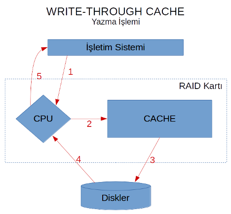
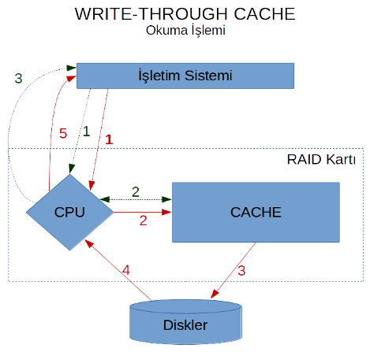
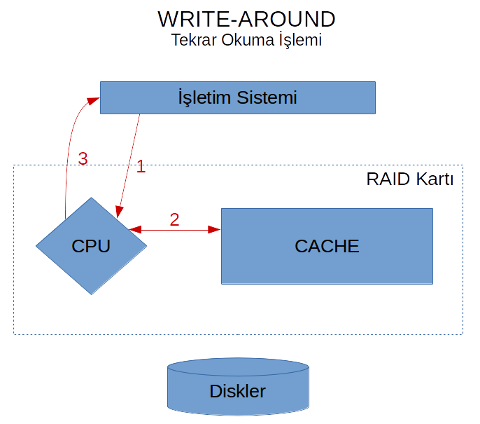

# RAID Önbellek (Cache) Mekanizmaları

Donanımsal RAID kontrol kartları, performansı artırmak için genellikle kendi üzerlerinde bulunan hızlı bir tampon bellek (önbellek - cache) kullanırlar. Bu önbellek, disk I/O işlemlerini hızlandırmak için çeşitli stratejilerle kullanılır. Yazılımsal RAID (`mdadm`) ise genellikle işletim sisteminin genel sayfa önbelleğini (page cache) kullanır, ancak ZFS gibi bazı çözümler kendi gelişmiş önbellekleme mekanizmalarına (ARC, L2ARC) sahiptir.

Donanımsal RAID kartlarındaki yaygın önbellek mekanizmaları şunlardır:

## Write-Through Cache

Aslında ismi hemen hemen ele veriyor kendisini. Bu mekanizma, yazma işlemlerinin tamamının _cache aracılığıyla_ yapılacağını belirtir. Kısacası veriyi RAID kartı önce cache'ye yazar, ardından disklere yazar. Disklere yazma işlemi tamamlandıktan sonra veriler cache'den silinmez, ve işletim sistemine "yazma işlemini bitirdim" sinyali gönderilir.

Yukarıdaki şekilde gerçekleşen adımlar aşağıdaki gibidir:

1. İşletim sistemi bir veriyi yazmak istediğini RAID kartına söyler. RAID kartı bunu kendi üzerindeki CPU'ya yönlendirir.
2. CPU yazma işlemini Cache'ye yapar.
3. Cache'ye yazma işlemi tamamlandıktan sonra, Cache'deki bu yeni veri Disklere yazılır.
4. Diskler yazma işlemini tamamladığı sinyalini RAID kartına yönlendirir.
5. RAID kartı yazma işleminin tamamlandığını işletim sistemine bildirir.

Burada önemli olan nokta, yazılan verinin hala Cache'de olmasıdır. Bu işlemin ardından, eğer işletim sistemi bir okuma isteği gönderirse, ve okumak istediği veriler "henüz yeni cache'ye yazılmış veriler"se, o zaman okuma işleminde ciddi hız kazancı sağlanır.

Yukarıdaki şekil, yazma işlemi gerçekleştirildikten sonra, işletim sisteminin "biraz önce yazılan veriyi" istediği takdirde izleyeceği yolları göstermektedir. Kırmızı oklar yazma işlemi, yeşil oklar ise okuma işlemini göstermektedir. Buradan görüleceği üzere, yeni yazılan veri hala cache üzerinde olduğu sürece, okuma işleminde disklere ihtiyaç olmayacaktır. Bu durum çok ciddi bir performans artışına sebep olur. Ancak istenilen verinin cache'de olmaması durumunda tabii ki disklerden veri okunacaktır.

Write-Through Cache mekanizması, yazma işlemlerinde güvenliği ön planda tutar ancak yazma hızında belirgin bir artış sağlamaz. Okuma performansı, yazılan verinin hemen ardından tekrar okunması durumunda artar.

## Write-Around Cache

Bu mekanizmada yazma işlemleri önbelleği **kullanmaz**; veri doğrudan disklere yazılır. Önbellek sadece okuma işlemleri için kullanılır. Bir veri diskten okunduğunda, bir kopyası önbelleğe alınır ve sonraki okuma istekleri önbellekten karşılanabilir.

*   **Avantajı:** Önbelleğin tamamı okuma işlemleri için kullanılabilir, bu da okuma ağırlıklı iş yüklerinde performansı artırabilir. Yazma işlemleri önbelleği "kirletmez".
*   **Dezavantajı:** Yazma işleminden hemen sonra aynı veriyi okumak gerektiğinde bir hızlanma sağlamaz, çünkü veri henüz önbellekte değildir.

Yukarıdaki örnekte gerçekleşen adımlar şu şekildedir:

1. İşletim sistemi yazma isteğini RAID kartına iletir.
2. RAID kartı CPU'su gelen veriyi doğrudan diske yazar.
3. Disk, yazma işleminin tamamlandığını RAID kartına bildirir.
4. RAID kartı yazma işleminin tamamlandığını işletim sistemine bildirir.

Görüldüğü üzere, cache hiç kullanılmamıştır. Dolayısıyla ilk yazma işleminde cache boş olacaktır. Şimdi bu senaryoda veri okunacağı zaman gerçekleşecek işlemlere bakalım.

1. İşletim sistemi okuma isteğini RAID kartına gönderir.
2. RAID kartı ilgili bloğun cache'de olup olmadığını kontrol eder.
3. Cache, üzerinde bu bilgi olmadığı için disklerden okur ve cache'ye yazar.
4. Cache okunan bilginin kopyasını CPU'ya iletir.
5. RAID kartı işletim sistemine bilgiyi iletir.

Bu işlemler sonucunda, cache'de artık bir miktar veri bulunmaktadır. Bundan sonra tekrar işletim sistemi istek gönderdiğinde, eğer ilgili veri biraz önce cache'ye yazılan veriyse, okuma işlemi hızlanacaktır.

Görüldüğü üzere, tekrar okuma işleminde (eğer daha önce okunan veri talep edilmişse) disklere gerek kalmaz.

## Write-Back Cache

Cache mekanizmaları arasındaki en verimli, ancak en güvensiz yöntemlerden birisidir. Bu yöntem temel olarak RAID kartının cache'sine güvenir, ve gelen yazma isteğini cache'ye yazmayı tamamladığı anda işletim sistemine "yazmayı tamamladım" sinyalini gönderir. Ardından cache'deki veriyi disklere yazma işlemini gerçekleştirir.

*   **Avantajı:** Yazma işlemleri, verinin sadece hızlı önbelleğe yazılmasıyla tamamlandığı için işletim sistemi açısından **çok hızlıdır**. Disk yazma gecikmesi hissedilmez.
*   **Dezavantajı:** **Veri kaybı riski yüksektir.** Veri önbelleğe yazıldıktan sonra ancak henüz disklere yazılamadan önce bir güç kesintisi olursa, önbellekteki (genellikle volatile RAM) veri kaybolur.

Bu riski azaltmak için Write-Back önbelleğe sahip RAID kontrolcüleri genellikle bir **Pil Yedekleme Birimi (BBU - Battery Backup Unit)** veya **süper kapasitör** ile birlikte gelir. Güç kesildiğinde BBU, önbelleğe güç sağlayarak içindeki verinin korunmasını sağlar. Güç geri geldiğinde, kontrolcü önbellekteki veriyi disklere yazar. BBU olmayan veya pili bitmiş bir kontrolcüde Write-Back modunu kullanmak **çok risklidir** ve genellikle kontrolcü tarafından otomatik olarak Write-Through moduna geçilir. Bazı modern kartlar veriyi kalıcı olarak saklayabilen **NVRAM (Non-Volatile RAM)** önbellekler kullanabilir.

## Read Ahead Cache

Bu cache'leme stratejisi yazma ile ilgili değil, okuma işlemleri ile ilgilidir. Normal şartlar altında işletim sistemi bir _parçanın_ okunmasını talep ettiğinde, RAID kartı ilgili veriyi disklerden okuyup cache'ye yazar, sonra işletim sistemine sunar. İşletim sistemi tekrar aynı veriyi isterse, bu verinin cache'de olması durumunda diskleri tekrar kullanmayıp cevap vermiş olur. Bu haliyle aslında read ahead yapmamış olur. Genellikle RAID kartlarında _No Read Ahead_ seçeneği bu anlama gelmektedir.

Öte yandan, eğer verilerimizde çoğunlukla sıralı okuma yapıyorsak, veya bir bloğa ulaştığımızda çoğunlukla o bloktan sonra gelen bloğa erişme ihtiyacı duyuyorsak, işletim sistemi herhangi bir parçayı RAID kartından istediğinde, RAID kartı akıllı davranıp "ondan sonra gelen parçaları da" okuyup cache'ye alabilir. Aşağıdaki örnek fikir verecektir.

*   **Avantajı:** Sıralı okuma yapılan durumlarda (örn. büyük dosya okuma, video streaming), bir sonraki istenmesi muhtemel veriler önbellekte hazır olduğu için okuma performansı artar.
*   **Dezavantajı:**
    *   Eğer erişim rastgele ise (örn. veritabanı sorguları), önceden okunan veriler muhtemelen kullanılmaz ve boş yere önbellek alanı işgal edilmiş, disk I/O yapılmış olur.
    *   Gereğinden fazla veri okumak diskler üzerinde ek yük oluşturabilir.
    *   Bazı kontrolcüler ne kadar ilerisinin okunacağını ayarlama imkanı sunar.

## Adaptive Read Ahead

Read ahead'in getirdiği problemleri bir nebze çözmek için bazı RAID kartı üreticileri adaptive read ahead algoritması kullanmaktadır. Biraz önceki senaryo örneğinde gidecek olursak, işletim sistemi RAID kartından **A** verisini istediğinde, RAID kartı disklerden sadece **A** verisini okuyup cache'lemekte ve işletim sistemine sunmaktadır. Bu noktada herhangi bir read ahead işlemi yapılmamaktadır. Daha sonra eğer işletim sistemi **B** verisini talep ederse, RAID kartı "daha önce **A** verisi de talep edilmişti, öyleyse muhtemelen **CDEF** verilerini de talep edecek" kararını verip bu sefer disklerden **BCDEF** verilerini okuyup cache'ye yazar. Bu sayede eğer gerçekten sıralı okuma yapılıyorsa **CDEF** talepleri geldiğinde veriler çok daha hızlı sağlanacaktır.

Read ahead mekanizmasına oranla dezavantajı, **A** verisinde yaşadığımız yavaşlığın **B** verisinde tekrar etmiş olması oldu. Ancak eğer sistemimizde rastgele okumalar ve sıralı okumalar kısmen bir arada yapılıyorsa, o zaman adaptive read ahead cache mekanizması bizim için daha uygun olabilir.
