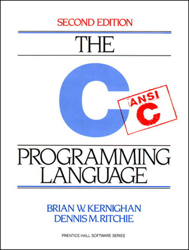

# Linux ve GNU'nun Geçmişi

## Unix ve C

1970'lerde, AT&T'nin Bell Laboratuarlarında Ken Thompson ve Dennis Ritchie öncülüğünde geliştirilmiştir. Her ne kadar işletim sistemi Bell ve AT&T'de kullanılmak üzere tasarlanmışsa da, 1970'lerin sonunda AT&T lisansı başka firmalara da açmıştır, böylece çeşitli firma ve kurumlar kendi Unix türevlerini piyasaya sürmüştür: Kaliforniya Üniversitesi, Berkeley (BSD), Microsoft (Xenix), IBM (AIX), Sun Microsystems (Solaris).

*Ken Thompson (solda) ve Dennis Ritchie (sağda)*

1990'ların başında AT&T Unix'in haklarını Novell'e satmıştır, Novell de 1995'te Santa Cruz Operations'a (SCO) satmıştır. Ancak günümüzde UNIX (büyük harflerle yazıldığında) endüstri standardı konsorsiyumu (The Open Group) tarafından tescillenmiştir ve ticari bir isim olarak kullanılmaktan ziyade, bir işletim sistemleri ailesi olarak anılmaktadır.

Unix'i diğer işletim sistemlerinden ayıran noktalardan birisi, işletim sisteminin hemen her platformda çalışabiliyor olmasıdır. Bu sayede Unix çok rahat bir biçimde farklı işletim sistemlerine dönüştürülebilmiş, farklı işlemci/bellek mimarilerinde yer edinebilmiştir.

Ayrıca **Unix felsefesi** olarak adlandırılan yapısı sistemi rahat geliştirilen, tutarlı bir hale getirmiştir. Bu felfese ile işletim sistemi küçük, basit, az ancak iyi tanımlanmış işler yapan programlardan oluşur. Bu programlar ortak bir dosya sistemi aracılığıyla iletişim kurarlar ve işletim sistemi programlanabilir bir kabuk (shell) ile basit işlemler yapan programları bir araya getirerek karmaşık problemlerin çözümüne olanak sağlar.

C programlama dili, Dennis Ritchi tarafından Unix işletim sistemi için geliştirilmiştir. Unix işletim sisteminin büyük çoğunluğu C ile yazılmıştır. C programlama dili, hem pek çok donanım üzerinde çalışabildiğinden, hem de öncülleri BCPL veya B gibi tip kullanmayan (typeless) bir dil olmadığından, ideal bir *sistem programlama dili* olarak nitelendirilir.

 

C programlama dilinin yaygınlaşmasına yardımcı olması dışında, bilgisayar bilimlerine yaptığı katkılardan ötürü Brian Kernighan ve Dennis Ritchie'nin yazdığı *The C Programming Language* kitabının yayımlanması da bir dönüm noktası kabul edilir.

## GNU

Bir yandan Ken Thompson ve Dennis Ritchie C ve Unix'i geliştirirken, Richard Stallman 1971 yılında MIT Yapay Zeka Laboratuvarlarında çalışmaya başlamıştı. Burada çalıştığı yıllarda, özellikle bir Xerox Lazer Yazıcı'nın sürücüsünün kaynak kodunun paylaşılmaması, ve beraberinde etrafında çalışan programcıların kendi geliştirdiği kodları Gizlilik Sözleşmeleri (Non-Disclosure Agreement) dahilinde satmaya başlamasıyla yazılımın özgür olması gerektiğini savunmaya başladı. Aslında o yıllarda programların kaynak kodlarıyla birlikte dağıtılıyor olması yaygındı ancak bu durum ticari kaygılarla ve firmalar arası rekabetle ortadan kalkmaya başlayınca, Richard Stallman bunun aksini savunmak için gerekli argümanlarını yeterince gözden geçirmediğini, inşa etmemiş olduğunu fark etti.

*Richard Stallman*

1980'lerden hemen her yazılım "değiştirilmeye ve kullanıcıları tarafından geliştirilmeye" yasak halde dağıtılıyordu. Bunun üzerine Richard Stallman Unix benzeri bir işletim sistemi ve bu sistemi çalıştıran yazılımlar grubu geliştirmeye karar verdi. Geliştirdiği bu yazılımları dağıtırken de daha önce karşılaştığı durumla başkalarının karşılaşmasını engellemek için özel bir lisanslama biçimi geliştirdi, lisanslama isminin adı GPL (General Public License) idi. Geliştirmeye başladığı sisteme ise "GNU is Not Unix"in kısaltması olarak GNU ismini verdi. Bu yazılımlar grubunu dağıtırken Özgür Yazılım Derneğ'ni (FSF: Free Software Foundation) kurmuş ve işinin MIT veya Yapay Zeka Laboratuvarları ile ilişkilendirilmemesi için MIT'den istifa etmiştir.

GNU'nun geliştirilmesi, Unix felsefesi dahilinde olmuştur. İşletim sistemi Unix-benzeri bir sistem olacak, baştan yazılacak ancak Unix'in bazı eksiklikleri giderilecekti. İşletim sisteminin çekirdeğine **Hurd**, çevre yazılımlarına ise GNU Projesi dahilindeki yazılımlar olarak bakılıyordu. Çoğunlukla sistemin geliştirilmesine çevre yazılımlarla başlanılmıştır. Bunların başında C derleyicisi olan GNU C Compiler (gcc) gelir.

## Linux

1980'ler boyunca GNU'nun gelişmesiyle birlikte, 1991 yılında Finlandiya'lı bilgisayar bilimleri öğrencisi olan Linus Torvalds kendi işletim sistemi çekirdeğini yazmıştır. Bu çekirdeği tamamen hobi olarak geliştirmiştir ve duyurusunu Usenet üzerinden duyururken "GNU kadar gelişmiş ve profesyonel bir şey olmayacağını" da belirtmiştir. İlk geliştirdiği dağıtımda, sadece çekirdeği yazdığı için, çevre araçları (küçük programlar, derleyiciler ve kabuk) GNU Projesinden almıştır.

*Linus Torvalds*

Linus Torvalds'in geliştirdiği işletim sistemini ilk başta farklı bir lisansla dağıtmış olsa da, 1992'de GNU GPL ile dağıtmıştır ve sistem bundan sonra başka programcılar tarafından hızla geliştirilmeye başlanmıştır. 1993 yılında 100'den fazla programcı Linux çekirdeğini geliştirmekle uğraşmıştır. Çekirdeğin geliştirilmesi haricinde Linux'un GNU ortamı ile uyumlu çalışması sağlanılmış ve aynı yıl içerisinde Slackware, yılın ilerleyen aylarındaysa Debian dağıtımları piyasaya çıkmıştır. Bugün hala geliştirilen bu iki dağıtımtan Slackware en eski dağıtım olup, Debian ise en yaygın dağıtımlardan birisidir.

Bugün GNU Hurd'ün geliştirilmesi hale devam etmektedir ancak Linux çekirdeği kadar yaygın bir kullanımı yoktur. Bugün piyasadaki yaygın sistemler, Linux çekirdeği etrafına GNU yazılımlarıyla dağıtılarak gelmektedir, dolayısıyla bu sistemlere **GNU/Linux** sistemler denilmektedir, ancak kolay söylenmesi amacıyla sistemin tamamına "Linux" denilmesi yaygındır. Richard Stallman 1995-1996 yıllarında bunun önüne geçilmesi için *LiGNUx* gibi bir terim önermiştir ancak bu söylem de tutmamıştır.

