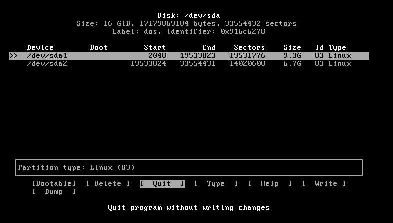

# Arch Linux

## Başlangıç

Arch Linux, kurulumun mümkün olabilmesi için aktif bir internet bağlantısı gerektirir. Aktif bir internet bağlantınız olduğundan emin olduktan sonra yükleme CD'sini boot ediniz. Boot ettikten sonra önünüze gelen ekranda "Boot Arch Linux (x86\_64)" seçeneğini seçiniz.


Boot etme işlemi tamamlandıktan sonra önümüze bir terminal gelecek ve yükleme işlemini buraya komutları girerek gerçekleştireceğiz.


## İnternet Bağlantısı Kurulumu

Yapacağınız ilk işlem, internet bağlantısını kontrol etmek olacak. Arch Linux kurulum ortamı, açıldığı andan itibaren dhcpcd daemon'unu aktif hale getirir ve internet bağlantısı kurmaya çalışır. Bağlantının mevcut durumunu kontrol etmek için `ping` komutunu kullanabilirsiniz. Örnek olarak:

`ping archlinux.org -c 5`

Eğer internet bağlantısı yoksa dhcpcd servisini `systemctl stop dhcpcd@<TAB>` komutuyla durdurmalı ve internet bağlantısı için gerekli ayarları yapmalısınız.

İnternet bağlantısı olmaması durumunda, `ip addr` veya `ifconfig` komutlarıyla interface ismini öğrenip `/etc/dhcpcd.conf` dosyasını tercih ettiğiniz editör programı (vi, vim veya nano) ile gerekli ayarları yapacak şekilde değiştirmelisiniz.

`vim /etc/dhcpcd.conf`

Örneğin statik bir IP konfigürasyonu aşağıdaki gibi olabilir. Bu satırlar dosyanın orijinal halinde bulunmayacaktır ama siz ekleyebilirsiniz.

```
interface eth0
static ip_address=10.1.1.30/24
static routers=10.1.1.1
static domain_name_servers=10.1.1.1

interface wlan0
static ip_address=10.1.1.31/24
static routers=10.1.1.1
static domain_name_servers=10.1.1.1
```

Bu ayarı yaptıktan sonra tekrar internete bağlanabilmeniz için dhcpcd servisini tekrar aktifleştirmelisiniz.

`systemctl start dhcpcd@<TAB>`

Eğer bağlantıyı wifi ile kuracaksanız, kablosuz interface ismini öğrenmek için `iw dev` komutunu kullanabilirsiniz. İnterface'in açık olduğundan emin olmak ve teyit etmek için

```

ip link set interface up
ip link show interface 
```

komutlarını kullanabilirsiniz. Aşağıdaki komutla Wi-Fi kurulum arayüzünü getirebilir ve gerekli ayarları yapabilirsiniz.

```

wifi-menu interface
```


İnternet bağlantısı sağlandıktan sonra sistem saatinin ayarının düzgün olduğundan emin olmalısınız.

`timedatectl set-ntp true`

## Diskler

Bundan sonraki basamak disklerin biçimlendirilmesi olacak. Disklerin mevcut durumunu öğrenmek için aşağıdaki komutu uygulayabilirsiniz.

```
lsblk
```


Biçimlendirme işlemi için `cfdisk` programını açıp, arayüz üzerinden mount pointleri ve partition boyutlarını ayarlayabilirsiniz. Eğer birden çok fiziksel sürücünüz varsa, `cfdisk /dev/sda` örneğinde olduğu gibi, ilgili sürücünün ayarlarını yapabilirsiniz.

`cfdisk` açıldıktan sonra size "partition table" biçimini soracaktır, "dos" olarak işaretleyebilirsiniz.

Gelen ekranda ok tuşlarını kullanarak \[New] seçeneğini işaretleyiniz ve ilgili partition için istediğiniz boyutu seçiniz. Aynı prosedürü kullanarak birden fazla partitionun ayarını yapabilirsiniz. Bu örnekte `/dev/sda` sürücüsü `/dev/sda1` ve `/dev/sda2` olmak üzere iki partition'a ayırılmış durumda.



Yaptığınız değişiklikleri kaydetmek ve diske yazmak için \[Write] seçeneğini seçip `yes` yazmalısınız. `lsblk` komutunu tekrar çalıstırdığınızda, yaptığınız değişikliklerin uygulanmış olduğunu göreceksiniz.


Şimdi dosya sistemlerinin oluşturulması gerekiyor. Bunu yapmak için yeni oluşturduğunuz her partition'u ayrı ayrı formatlamalısınız.

```
mkfs.ext4 /dev/sda1
mkfs.ext4 /dev/sda2
```

Bu komutları uyguladığınızda `sda1` ve `sda2` partitionlarınız `ext4` dosyalama sisteminde formatlanmış olacak. Formatlayabileceğiniz başka dosyalama sistemleri ve ilgili komutlar için `man mkfs` komutunu çalıştırabilirsiniz.

Eğer bir swap partitionu istiyorsanız tek yapmanız gereken, normal partition'ların yaratılma prosedürüne ek olarak, yeni bir partition daha kurmak ve aşağıdaki komutları çalıştırarak swap partition'unu aktif hale getirmek. Örneğin bir `/dev/sda3` partitionu swap olarak kurulmak istendiğinde bu komutlar kullanılabilir. Bunu yaparken cfdisk içerisinden _type_ olarak **swap** seçmelisiniz.

```
mkswap /dev/sda3
swapon
```

Bu işlemleri tamamladığınızda, yaptığınız değişiklikleri görmek için `blkid` komutunu kullanabilirsiniz.

Mount pointlerin ayarlanması için önceden ayarlamış olduğunuz partition'ları, aşağıdaki komutları kullanarak uygun gördüğünüz yerlere mount etmelisiniz. Verilen örnek ayrı `/home` ve `/` (root) partition'ları içindir. `/home` partition'ınını kurmak içi önce gerekli alt dizini açmalısınız. Bu aşamada `/mnt` dizinini, kurmak istediğiniz sistemin root dizini olarak düşünmek size yardımcı olacaktır.

| Komutlar                    | Açıklamalar                                                                                |
| --------------------------- | ------------------------------------------------------------------------------------------ |
| `mount /dev/sda1 /mnt`      | sda1 diskini root partition'u olarak mount eder                                            |
| `mkdir /mnt/home`           | Sistemimizi kuracağımız / dizini altındaki /home dizinimizi temsil edecek dizini oluşturur |
| `mount /dev/sda2 /mnt/home` | sda2 diskini ilk komut ile yarattığımız /home dizinine mount eder                          |

Bu işlemler sonrasında ulaşmak istediğimiz sonuç şekildeki gibidir.


Bununla sistemin bu şekilde kurulmasını amaçlıyoruz.

```
root (sda1)
│   bin    ───────────────>
│   etc    ───────────────>
│   dev    ───────────────>
│   proc   ───────────────>
│   var    ───────────────>
│   tmp    ───────────────> Bu dizinler sistem kurulduğunda oluşacak.
│   usr    ───────────────>
│   boot   ───────────────>
│   lib    ───────────────>
│   home (sda2)
│   opt    ───────────────>
│   mnt    ───────────────>
│   media  ───────────────>
│   srv    ───────────────>
```

## Kurulum

"/" olmasını istediğiniz partition /mnt altında mount edildiği için sistemin yüklemesini bu dizinde yapmalısınız. Arch Linux, kurulum için `pacstrap` script'ini kullanır. `pacstrap` birinci argüman olarak sistemin kurulacağı dizini alır. Diğer argümanlar ise sistem kurulurken kurulacak paketleri gösterir. `base` ve `base-devel` paketler Arch Linux'un temelini oluştururken burada ek olarak `vim` paketinin kuruluş esnasında yüklenebileceğini gösteren bir örnek verilmiştir.

`pacstrap /mnt base base-devel vim`

Bu komut uygulandıktan sonra internet hızınıza bağlı olarak bir süre paketlerin inmesini ve kurulmasını bekleyeceksiniz.


İşlem tamamlandıktan sonra `fstab` dosyasını oluşturmanız gerekiyor. Bunu "label" ya da "UUID" kullanarak yapabilirsiniz ancak tavsiye edilen yöntem UUID kullanmaktır (UUID'leri görmek için daha önce bahsi geçen `blkid` komutunu kullanabilirsiniz).

`genfstab -U -p /mnt >> /mnt/etc/fstab`

Bu işlem de tamamlandıktan sonra `vim /mnt/etc/fstab` komutuyla `fstab` dosyasını kontrol edebilir ve üzerinde değişiklik yapabilirsiniz.


`arch-chroot /mnt` komutunu kullanarak kurduğunuz sistemin içine girmelisiniz. Bu size yeni kurduğunuz sistemin `root` kullanıcısı gibi davranma gücü verir.

Dil ayarlarını yapmak için aşağıdaki dosyayı kullanmalısınız.

`vim /etc/locale.gen`

Bu dosyanın içinde, sistem kurulduğunda hangi dilleri kullanmak istiyorsanız onları başlarındaki "#" işaretini kaldırarak uncomment etmelisiniz. Bu işlemi tamamladıktan sonra dil ayarını oluşturmak için aşağıdaki komutları uygulamalısınız. Örnekte en\_US kullanılmıştır, diğer dilleri `locale.gen` dosyasında bulabilirsiniz.

```
locale-gen
echo LANG=en_US.UTF-8 > /etc/locale.conf
export LANG=en_US.UTF-8
```

Klavyeyi ayarlamak için `/etc/vconsole.conf` dosyasını kullanabilirsiniz. İngilizce için `en` veya Türkçe için `tr` parametrelerini kullanarak dosyanın içine yerleştirebilirsiniz.

`echo KEYMAP=en > /etc/vconsole.conf`

Sonraki adım zaman diliminin ve zamanın ayarlanması olmalıdır. Bunun yanında hardware saatini de ayarlamalısınız.

```
ln -s /usr/share/zoneinfo/Turkey /etc/localtime
hwclock --systohc --utc
```

Yaptığınız zaman ayarlarını kontrol etmek için `date` komutunu kullanabilirsiniz.

Belirlediğiniz makine ismini (hostname) ayarlamalısınız.

`echo MAKİNE_İSMİ > /etc/hostname`

Kullanıcı eklemek için aşağıdaki komut uygulanmalıdır.

`useradd -m -g kullanıcı_grubu -G ek_gruplar -s kullanılacak_shell kullanıcı_adı`

Örnek olarak:

`useradd -m -g users -G wheel,storage,power -s /bin/bash tunc`

Bu işlemi takiben hem `root` kullanıcısı hem de yeni oluşturduğunuz kullanıcı için şifre belirlemelisiniz.

`passwd` ---- > root şifresi için

`passwd kullanıcı_adı` ---- > kullanıcı şifresi için

`wheel` grubuna dahil edilen normal kullanıcıların `sudo` komutunu kullanarak yönetici komutlarını uygulayabilmelerini istiyorsanız buna bağlı ayarları yapmalısınız.

`EDITOR=vim visudo`

Bu komut ile açılan dosyada `%wheel ALL=(ALL) ALL` satırını uncomment etmelisiniz.


Bu aşamada artık internet ayarlarını tekrar, bu sefer içine `chroot` ettiğiniz sistem için tekrar yapıp kurulmuş olan yeni sistem için dhcpcd servisini aktif hale getirmelisiniz.

```
vim /etc/dhcpcd.conf
systemctl enable dhcpcd
```

Sistemin içine boot edebilmek için GRUB'ı yükleyip kurmalısınız. Eğer birden fazla işletim sistemi yüklüyse ve GRUB'ın konfigürasyon dosyası oluştururken bunu da dikkate almasını istiyorsanız `os-prober` paketini de bu aşamada yüklemelisiniz.

```
pacman -S grub os-prober
grub-install --target=i386-pc --recheck /dev/sda
grub-mkconfig -o /boot/grub/grub.cfg
```

Bu işemin sonucunda `/dev/sda` cihazına GRUB'ı yüklemiş oldunuz ve makine ne zaman bu cihazdan boot ederse, ayarları bu basamakta yapılan GRUB ile açılacaktır.


Bu basamaklar tamamlandıktan sonra chroot ortamından çıkıp partition'larınızı unmount edebilirsiniz.

```
exit
umount -R /mnt
```

Bilgisayarınızı teniden başlatıp yükleme diskini bilgisayardan çıkartın. Bu aşamada Arch Linux sistem kurulumu tamamlanmış olur. Kurulum tamamlandıktan sonra ilk olarak sisteminizi güncellemeniz tavsiye edilir.

`pacman -Syu`
