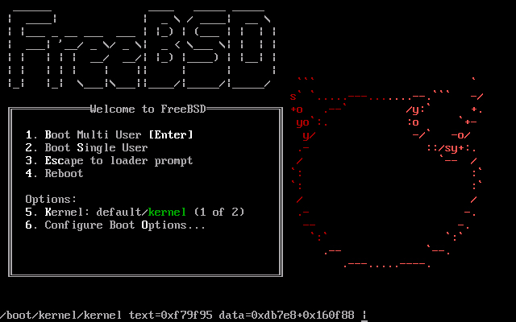
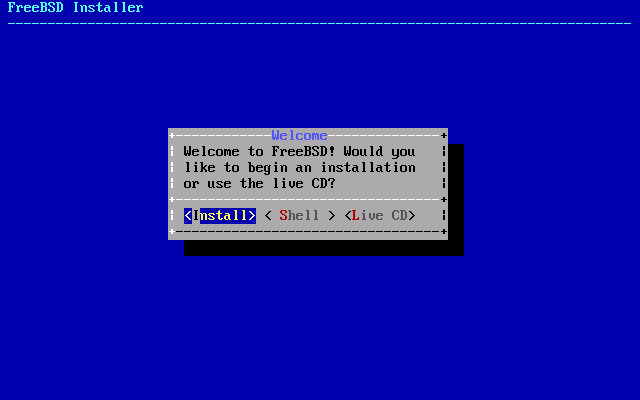
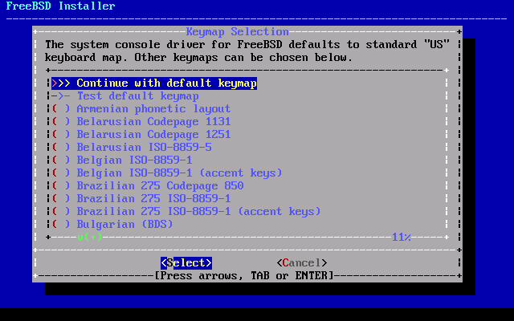
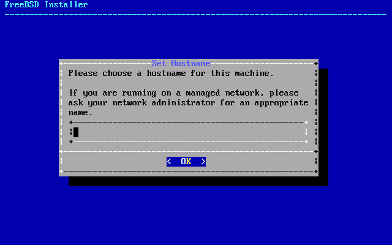
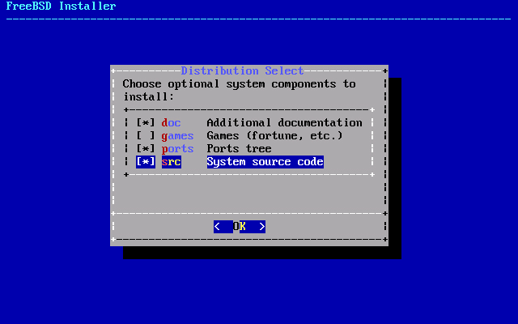
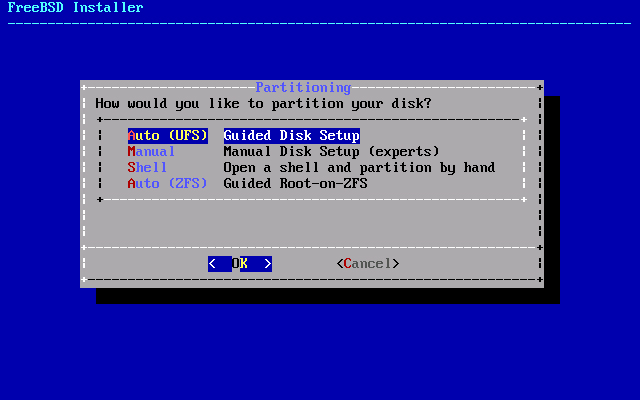
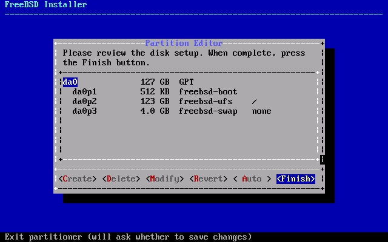

# FreeBSD

FreeBSD yükleme CDsini boot ettikten sonra önümüzde çıkan ekranda 1 basarak işleme başlıyoruz.

Install seçiyoruz.

Klavye dizilimini seçiyoruz. Bu noktada defaultta kalması bizim için uygun seçenek olacaktır.

Hostname'i burada tanımlıyoruz.

Sistem bileşenlerini seçiyoruz.

Disk bölümlemesini ayarladığımız ekranda otomatik ve manuel olarak diskimizi bölümlendirebiliriz.

Bu ekranda default bölümleme önümüze gelecektir. Burda dilerseniz silebilir veya kullanım kolaylıgına göre modifiye edilebilir. Varolan değişiklikleri diske kaydetmeyi unutmayınız.

Yükleme ekranından sonra bilgisayar yeniden başlayarak FreeBSD yüklemesin tamamlanacaktır.
