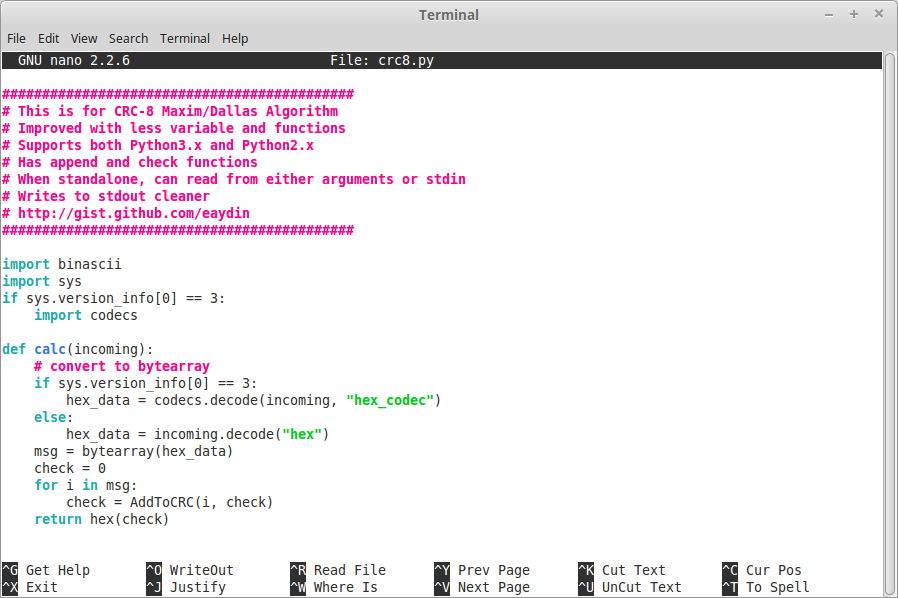

# nano ve pico

nano ve pico programları aslında birbirlerinin aynısıdır. Pico (Pine composer) geliştirildiğinde bir _free software license_ altında dağıtılmadığından, kodun değiştirilerek dağıtılması yasal değildi. Dolayısıyla GNU Projesi kapsamında pico'nun işlemlerini taklit eden bir program geliştirildi ve ismi **nano** oldu. Bugün **nano** orijinal pico'dan daha kapsamlı duruma gelmiştir. Kullandığınız Linux dağıtımlarında pico komutu da aslında nano'yu çalıştırmaktadır.

Aslında pico için özgür lisanslı bir yazılım amacıyla Chris Allegretta tarafından nano ile geliştirildiğinde ismi TIP konuldu _(This isn't Pico)_, ancak Unix üzerindeki _tip_ yazılımı ile karışabileceği gerekçesiyle ismi daha sonra _nano_ olarak değiştirildi. _nano_ SI birim sisteminde _pico_dan 1000 kat daha büyük olan bir uzunluk birimidir.

nano ve pico farklarının yaratacağı kafa karışıklığını giderdiysek, programın genel kullanımına bakabiliriz.

Önceki bölümde crc8.py dosyamızın yetkilerini görüntülemiştik.

Eğer aşağıdaki örnekleri gerçek crc8.py dosyasıyla kullanmak istiyorsanız **wget** ile dosyayı edinebilirsiniz.

```bash
wget http://bit.ly/1kBiBAE -O crc8.py
```

Yukarıdaki komut, _github_ üzerinde ilgili _gist_'i indirip mevcut dizinin _crc8.py_ dosyasına yazacaktır.

Şimdi dosyanın içeriğine göz atalım. Dosyaya GNU/Linux üzerinde cat, less, more, head gibi komutlarla göz atabiliriz. Ancak dosyanın içeriğini değiştirmek için bu yöntemler pratik olmayacaktır. Dosyanın bulunduğu dizinde aşağıdaki komutlardan birini çalıştırarak dosyayı nano ile açabiliriz.

```bash
nano crc8.py
pico crc8.py
```



Burada dosyamızın içeriğini görüyoruz. Kullandığımız dağıtımda nano dosyanın uzantısına bakarak dosyamızın içeriğinin bir Python kodu olduğunu anlıyor ve gerekli renklendirmeyi yapıyor.

Alt iki satırda gördüğünüz komutlar, klavye kısayollarıyla erişiliyor. Komutlara erişmek için CTRL ile birlikte ilgili kısayolu kullanmak gerekiyor. Örneğin "Get Help" fonksiyonunu çağırmak için CTRL+g tuşlarına basmak gerekiyor. Gelen menüden nano için kullanılabilecek bütün komutları görebilirsiniz.


nano içerisinde gezinmek için ok tuşlarını kullanmanız yeterli. Değiştirmek/eklemek/silmek istediğiniz noktaya imleci getirdiğinizde istediğiniz değişikliği yaptıktan sonra dosyayı kaydetmek için CTRL+o programdan çıkmak içinse CTRL+x tuşlarını kullanmanız yeterlidir.

Dosyamızın en başında # işaretleriyle başlayan bir dizi satır görülüyor. Bu satırlar açıklama satırlarıdır, yani Python yorumlayıcısı tarafından bu satırlar gözardı edilecektir. Çoğu programlama dilinde ve çoğu ayar dosyasında açıklama satırları # işareti ile başlar.

nano, açıklama satırlarını istersek hizalı hale getirebilir. Bunun için _Justify_ ve _Unjustify_ komutları kullanılabilir.

İmleci açıklama satırlarının olduğu bölgeye getirip CTRL+j ile satırları hizalayabiliriz.


Ekranda _Can now UnJustify!_ yazısı belirdi. Değişikliği gördükten sonra CTRL+u ile tekrar eski haline getirebiliriz.
