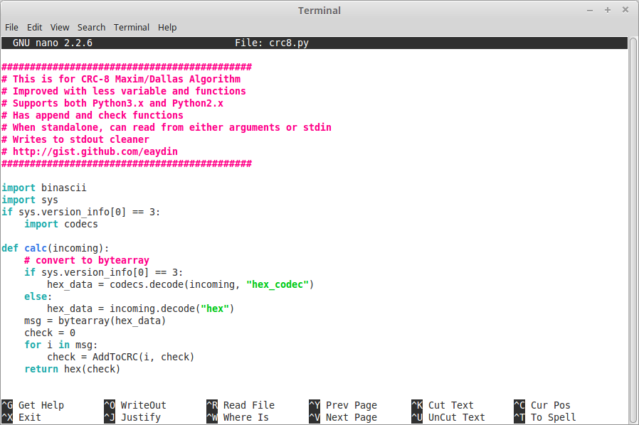

# nano ve pico

nano ve pico programları aslında birbirlerinin aynısıdır. Pico (Pine composer) geliştirildiğinde bir *free software license* altında dağıtılmadığından, kodun değiştirilerek dağıtılması yasal değildi. Dolayısıyla GNU Projesi kapsamında pico'nun işlemlerini taklit eden bir program geliştirildi ve ismi **nano** oldu. Bugün **nano** orijinal pico'dan daha kapsamlı duruma gelmiştir. Kullandığınız Linux dağıtımlarında pico komutu da aslında nano'yu çalıştırmaktadır.

nano ve pico farklarının yaratacağı kafa karışıklığını giderdiysek, programın genel kullanımına bakabiliriz.

Önceki bölümde crc8.py dosyamızın yetkilerini görüntülemiştik. Şimdi dosyanın içeriğine göz atalım. Dosyaya GNU/Linux üzerinde cat, less, more, head gibi komutlarla göz atabiliriz. Ancak dosyanın içeriğini değiştirmek için bu yöntemler pratik olmayacaktır. Dosyanın bulunduğu dizinde aşağıdaki komutlardan birini çalıştırarak dosyayı nano ile açabiliriz.

```bash
nano crc8.py
pico crc8.py
```



